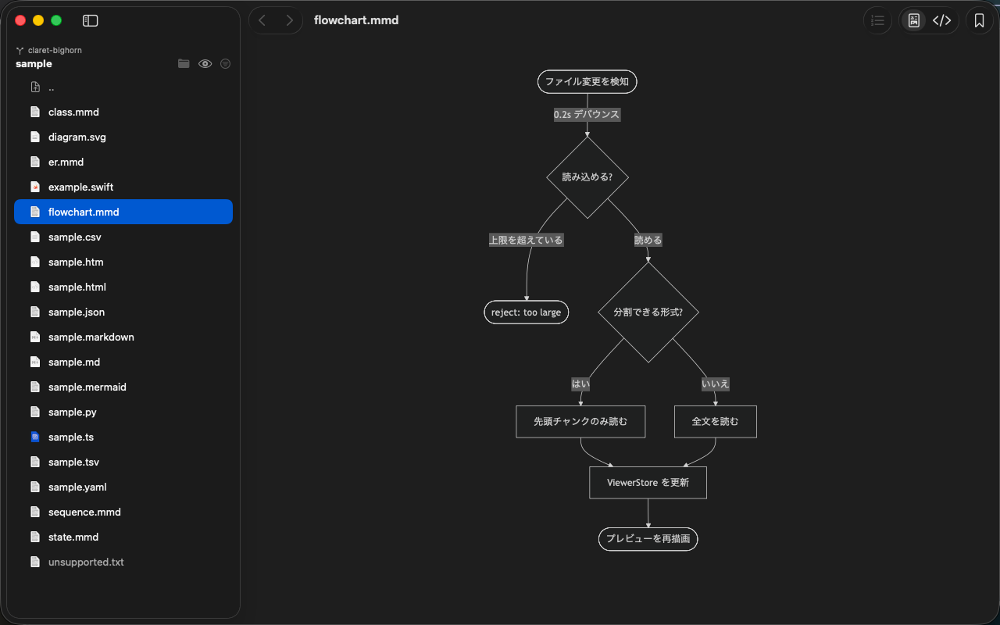
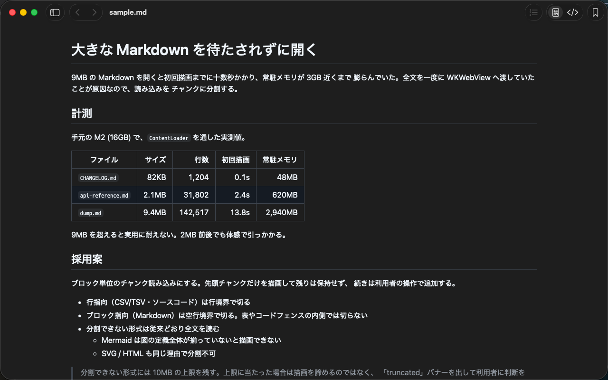
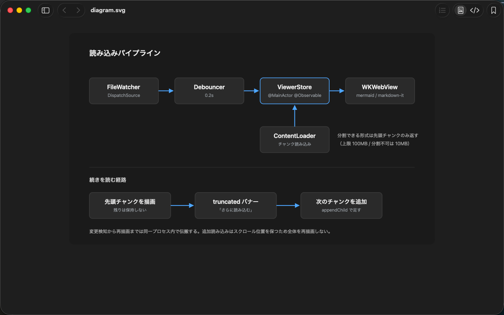
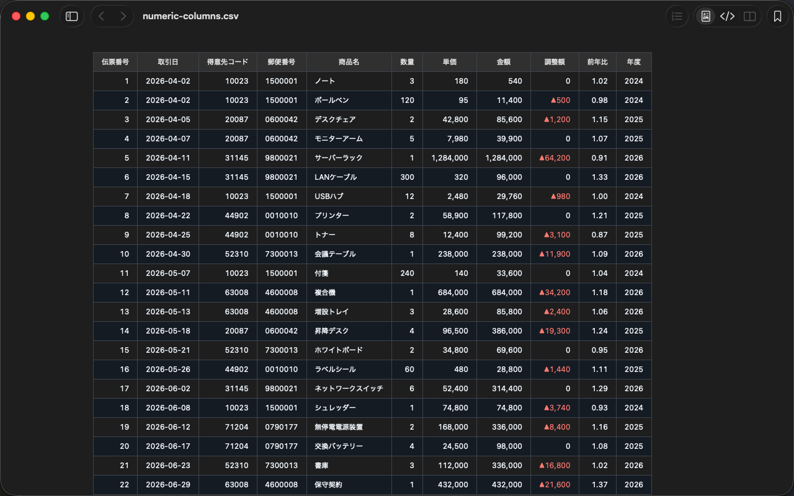
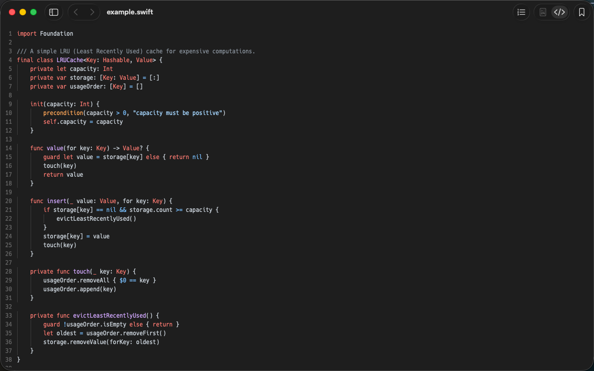
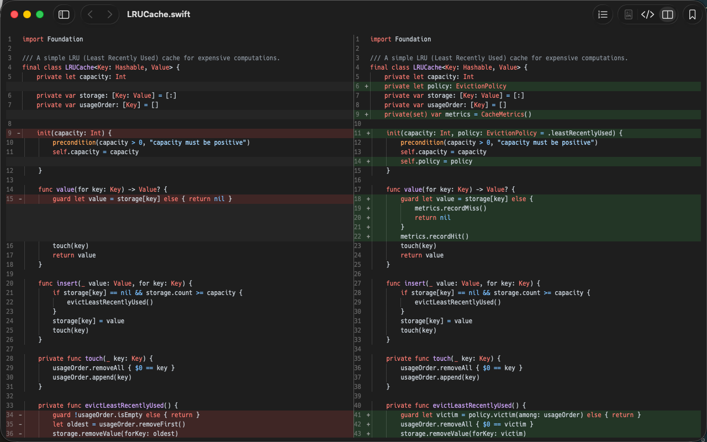
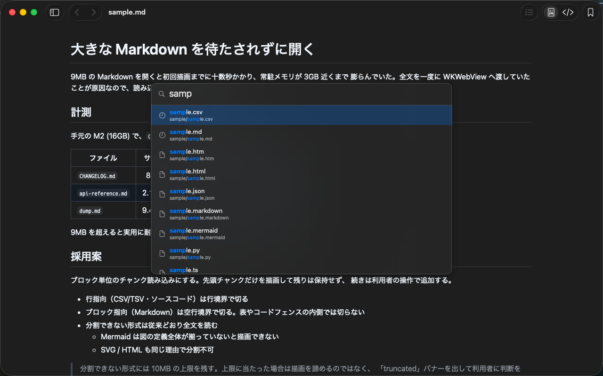
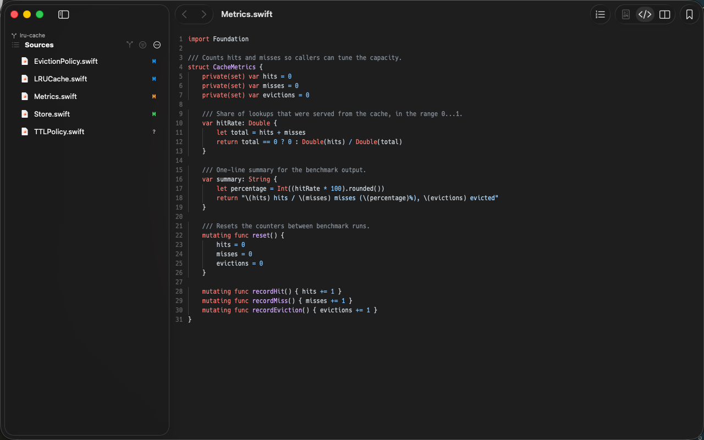

<!-- markdownlint-disable MD033 -->
<!-- MD033/no-inline-html: GitHub の README はヒーロー画像の中央寄せ・スクリーンショットの
     幅指定・機能一覧の折りたたみに inline HTML を要する（Markdown 記法では表現できない）。
     このファイルは GitHub の表示専用なので、ここだけ許可する。 -->

<div align="center">

# befold

**Open a file. See it rendered. Instantly.**

A native macOS viewer for Mermaid, Markdown, SVG, CSV, images, PDF, and source code —
with live reload, fuzzy file search, and side-by-side git diffs.

[](https://github.com/YTommy109/befold/releases/latest)
[](#requirements)
[](LICENSE)

[**Download**](https://befold.degino.com/download?ref=readme) ·
[**Website**](https://befold.degino.com/?ref=readme) ·
[日本語 README](README.ja.md)



</div>

---

## Why befold

Preview tools usually make you pick one: an editor plugin that only works inside that editor,
a browser tab you have to refresh by hand, or a web service you paste private files into.

befold is a standalone macOS app that just opens the file. It renders in-process, watches the
file, and repaints the moment you save — no editor, no server, no upload.

## Use cases

**Check what your AI coding agent just produced.**
Agents emit Mermaid diagrams and Markdown specs constantly. `befold docs/design.mmd` opens it
rendered, and every rewrite by the agent repaints the window automatically. No copy-pasting
into mermaid.live.

**Get a preview pane in a terminal-only workflow.**
If you work in Claude Code, Codex, vim, or plain shell, there is no preview pane to open.
befold is that pane: run `befold spec.md` once, park the window next to your terminal, and it
repaints on every save. It only reads the file, so it never fights your tools over it.

**Read through an unfamiliar repository.**
`⌘P` fuzzy-opens any file in the tree, `⌘+click` follows a link or file reference, and
`⌘[` / `⌘]` walk your history back and forth — the navigation you'd expect from an IDE,
in a viewer you don't have to configure.

**Review changes with a real diff.**
Inside a git repository, befold shows side-by-side diffs in the source view and marks changed
files in the sidebar.

**Preview from Finder without opening anything.**
The bundled QuickLook extension means pressing Space on a `.mmd` or `.md` file shows the
rendered result straight away.

## What it renders

| | |
|---|---|
| <br>**Markdown** — GitHub-flavored, with syntax-highlighted code blocks | <br>**Mermaid** — flowcharts, sequence, class, ER, state diagrams |
| <br>**SVG & images** — plus PNG / JPG / GIF / WebP / BMP / ICO / PDF | <br>**CSV / TSV** — rendered as a table, streamed for large files |
| <br>**Source code** — 30+ languages, 49 extensions, `⌘U` to toggle | <br>**Git diff** — side-by-side, right in the source view |
| <br>**Quick Open** — `⌘P` fuzzy path search, keyboard only | <br>**Git status** — changed files marked in the sidebar |

## Requirements

macOS 14 (Sonoma) or later.

## Install

1. [Download the latest release](https://befold.degino.com/download?ref=readme)
2. Open the DMG, copy `befold.app` into `/Applications`, and launch it

## Command line

Run **"Install Command Line Tool"** from the app menu to get the `befold` command.

```bash
befold path/to/diagram.mmd     # open a file (multiple paths open in separate windows)
befold path/to/dir             # open a folder's supported files with the sidebar
befold --check path/to/file    # only report whether the file can be opened
befold --bookmark path/to/file # add to bookmarks without opening
befold --help                  # list available options
```

Display options can be passed alongside the paths: `--line-numbers` / `--no-line-numbers`,
`--sidebar` / `--no-sidebar`, `--source` / `--preview`,
`--sort folders-first|alphabetical`. They apply to the files being opened (if a file is
already open, its window is updated). Only `--hidden-files` / `--no-hidden-files` is an
app-wide setting and can be used without a path. To open a path starting with a hyphen, put
it after `--` (e.g. `befold -- -notes.md`).

`befold` is a symlink into `/Applications/befold.app`. If you move the app elsewhere, run
"Install Command Line Tool" again.

<details>
<summary><b>Full feature list</b></summary>

### Viewing

- **Formats**: Mermaid (`.mmd` / `.mermaid`), Markdown (`.md` / `.markdown`), SVG, HTML,
  CSV, TSV rendered; PNG / JPG / GIF / WebP / BMP / ICO / PDF displayed; 30+ languages
  (49 extensions) shown with syntax highlighting
- **Rendered / source toggle**: `⌘U` switches between the rendered result and the source
  (`⌘L` toggles line numbers)
- **Live reload**: saving the file refreshes the preview automatically (0.2s debounce)
- **Progressive rendering**: Markdown, CSV/TSV, and source files are read and drawn from the
  top in chunks, so huge files don't block
- **Zoom**: `⌘+` / `⌘-` / `⌘0`
- **Find in page**: `⌘F` to search, `⌘G` / `⇧⌘G` to step through matches
- **Finder QuickLook**: the bundled QuickLook extension previews files with the Space key,
  without launching the app

### Moving between files

- **Sidebar**: `⌘S` toggles it. Lists files in the same folder with folders-first or
  alphabetical sorting, name filtering, and `⌃⌘H` to show hidden files. Inside a git
  repository, relative paths are resolved against the repository root
- **Quick Open**: `⌘P` fuzzy-searches paths and opens files from the keyboard
- **Follow file references**: `⌘+click` opens a link or referenced file. `⌘[` / `⌘]`
  (or a two-finger swipe) goes back and forward
- **Bookmarks**: `⌘B` marks files you open often; reopen them from the File menu
- **Recent items / repositories**: recent files, plus repositories that reopen with their
  previous tab layout

### Windows and app

- **Tabs & session restore**: native macOS tabs, with the previous window and tab layout
  restored automatically
- **Preferences**: change the code font family and size used in the source view (`⌘,`)
- **In-app updates**: new version notifications and one-click updating
- **Help**: feature guide, keyboard shortcut reference, and a guide to using befold with AI
  coding agents, all from the Help menu

</details>

## Acknowledgements

befold's rendering is built on these open source libraries. Thanks to their authors and
contributors.

| Library | Role | License |
| --- | --- | --- |
| [Mermaid](https://github.com/mermaid-js/mermaid) | Mermaid diagram rendering | MIT |
| [markdown-it](https://github.com/markdown-it/markdown-it) | Markdown parsing and rendering | MIT |
| [highlight.js](https://github.com/highlightjs/highlight.js) | Syntax highlighting in the source view | BSD-3-Clause |
| [DOMPurify](https://github.com/cure53/DOMPurify) | HTML sanitizing before rendering | Apache-2.0 / MPL-2.0 |
| [github-markdown-css](https://github.com/sindresorhus/github-markdown-css) | Markdown styling | MIT |
| [Sparkle](https://github.com/sparkle-project/Sparkle) | In-app updates | MIT |
| [swift-argument-parser](https://github.com/apple/swift-argument-parser) | Argument parsing for the `befold` command | Apache-2.0 |
| [libgit2](https://github.com/libgit2/libgit2) | Reading git diffs and status | GPLv2 with linking exception |

Full license texts are collected in
[THIRD_PARTY_LICENSES.md](BefoldApp/BefoldKit/Resources/THIRD_PARTY_LICENSES.md), which is
also bundled inside befold.app.

## License

MIT — see [LICENSE](LICENSE).
