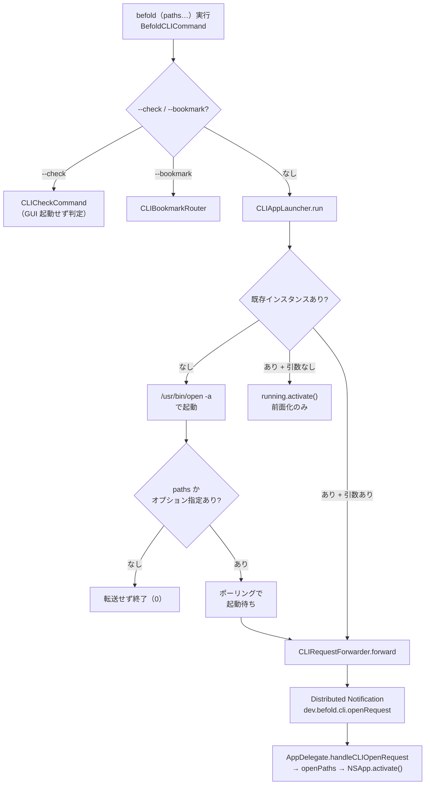

# CLI 起動経路とワイヤプロトコル

<!-- derived-from ./native-app-design.md#モジュール構成 -->
<!-- constrained-by ../adr/0001-keep-appkit-app-lifecycle.md -->

本文書は `befold` コマンド実行から `befold.app` の起動/前面化・パス転送までの経路
と、CLI ↔ 本体アプリ間のワイヤプロトコルを解説する。

## ターゲット構成

CLI は 2 つのターゲットに分かれる。

| ターゲット | 位置 | 役割 |
|---|---|---|
| `befold-cli`（実行ファイル） | `BefoldApp/befold-cli/` | 送信側の関心（宛先探索・起動・再送・ACK 待ち）。ArgumentParser にも依存 |
| `BefoldCLI`（ライブラリ） | `BefoldApp/BefoldCLI/` | 送受信で共有するワイヤ表現・要求型・各サブコマンドのロジック。受信側 GUI もこちらをリンク |

本体 GUI の受信は `BefoldApp/befold/App/AppDelegate.swift`。

**チャネルは Distributed Notification のみ**。XPC も URL scheme も argv 転送も
使っていない。

## 起動 → 前面化までの全経路

エントリポイントは `BefoldCLICommand`（`befold-cli/BefoldCLICommand.swift`、
`@main struct ... AsyncParsableCommand`、`commandName: "befold"`）。フラグは
`--check` / `--bookmark`、表示オプションは `@OptionGroup var openOptions:
OpenCLIOptions`、位置引数は `@Argument var paths: [String]`。

`--check` / `--bookmark` いずれも無ければ `run()` が
`CLIAppLauncher.launch(paths:options:)` を呼ぶ。

### 表示オプションはパスを要する

`--source` / `--preview`、`--line-numbers` / `--no-line-numbers`、
`--sidebar` / `--no-sidebar`、`--sort` は「その文書をどう表示するか」の指定なので、
対象が無ければ適用先が無い。`BefoldCLICommand.validate()` が
`CLIOpenOptions.requiresPaths` を見て、次の 2 つをパース段階でエラーにする。

- パスを 1 つも渡していない
- ウィンドウを開かない `--check` / `--bookmark` と併用している

例外は `--hidden-files` / `--no-hidden-files` だけで、これはサイドバーの不可視ファイル
表示というアプリ全体設定のため対象を要さない。`requiresPaths` を
`options != CLIOpenOptions()` で代用してはならない（`--hidden-files` 単独まで弾く）。
`CLIAppLauncher` が使う `options == CLIOpenOptions()` は「そもそも GUI へ転送するか」の
別判定であり、目的が違う。

かつてはパス無しの表示オプションを、開いている全ウィンドウへ適用していた
（`ViewerWindowManager.applyDisplayOverrides`、TASK-82）。この経路だけが
表示モードの保存値を恒久的に書き換えていたため、TASK-413 で撤去した。

`CLIAppLauncher.run(...)`（`befold-cli/CLIAppLauncher.swift`）の判断ロジック:

1. paths を `standardizedFileURL.path` に正規化する
2. `CLIRequestForwarder.runningInstance()` で既存インスタンスを探す
3. **既存あり かつ paths 空・オプション既定** → `running.activate()` で純粋な
   前面化（転送なし）
4. **既存あり かつ 引数あり** → `CLIRequestForwarder.forward(...)` へ転送する
5. **既存なし** → `/usr/bin/open -a <bundlePath>` で起動する。bundlePath は
   `AppVersion.actualExecutablePath()` → `bundlePath(fromExecutablePath:)` で解決
6. 起動後、**paths 空・オプション既定なら転送せずそのまま終了（0）**。素の
   `befold` 実行では Distributed Notification は送られない
7. paths かオプションがある場合のみ、0.1s 間隔・10s タイムアウトで
   `runningInstance()` をポーリングし、出現したら `forward(...)` する
   （タイムアウトしたらエラーを出力して 1 を返す）



引数変換の境界は `OpenCLIOptions`（`befold-cli/OpenCLIOptions.swift`）。
ArgumentParser 依存の Flag を、`cliOpenOptions` プロパティで ArgumentParser 非依存
の `CLIOpenOptions`（BefoldCLI）へ変換する。3 値意味論（nil = 保存済み設定を維持）。

## ワイヤプロトコル

要求型 `CLIRequest`（`BefoldCLI/CLIRequest.swift`）:

```swift
enum CLIRequest: Equatable, Codable, Sendable {
    case open(paths: [String], options: CLIOpenOptions)
    case bookmark(paths: [String])
}
```

`CLIOpenOptions`（`showHiddenFiles` / `sortOrder` / `showLineNumbers` /
`sourceMode` / `showSidebar`、全 Optional な Codable struct）の Codable 適合が
ワイヤ表現の唯一の情報源。

シリアライズ層 `CLIRequestWire`（`BefoldCLI/CLIRequestWire.swift`）:

- 通知名: `requestNotificationName = "dev.befold.cli.openRequest"`、
  `ackNotificationName = "dev.befold.cli.openRequestAck"`
- `userInfo(for:requestID:)`: `CLIRequest` を JSONEncoder で JSON 文字列化し、
  `userInfo["request"]` / `["requestID"]` に載せる（Distributed Notification の
  userInfo は plist 表現限定のため JSON 文字列で包む）
- チャネル:
  `DistributedNotificationCenter.default().postNotificationName(..., deliverImmediately: true)`。
  宛先指定なしのブロードキャスト（単一 GUI インスタンスだけが受ける）

送信の駆動 `CLIRequestForwarder`（`befold-cli/CLIRequestForwarder.swift`）:

- `runningInstance()`: `NSRunningApplication.runningApplications(withBundleIdentifier:
  AppBundle.identifier)` から自プロセス以外を返す。`Bundle.main` ではなく
  `AppBundle.identifier`（`com.degino.befold`）を使う（symlink 起動で
  `Bundle.main` の bundleIdentifier が nil になるため）
- `postAwaitingAck(...)`: `UUID().uuidString` で requestID を採番し、AckWaiter を
  先に作ってから最大 `maxForwardAttempts = 20` 回 post、各回 `ackTimeout = 0.5s`
  待つ（総予算 10 秒）

## ACK 待ち（AckWaiting）

`AckWaiting` プロトコル / `DistributedAckWaiter`（`befold-cli/AckWaiting.swift`）。

- 役割: 転送要求が**実際に届いた確証**を得る。宛先プロセスの生存はオブザーバ
  未登録の可能性があり証拠にならないため、ACK 未観測なら失敗を返す（無言失敗の回避）
- `init(requestID:)` の時点で `ackNotificationName` のオブザーバを登録＝観測開始。
  post のたびに登録/解除しないのは、再送合間の ACK 取りこぼし窓を作らないため
- `wait(timeout:) async -> Bool`: 20ms 間隔で `Task.sleep` しつつ acked を確認。
  **必ず async**（async main コンテキストで `RunLoop.run` を同期に回すと Distributed
  Notification が配送されないため）

再送は GUI 側が requestID で重複排除するため、二重オープンにはならない。

## サブコマンド

**`--check`**（`BefoldCLI/CLICheckCommand.swift`）: GUI を起動せず、GUI と同じ
`SupportedFileResolver` / `ViewerLoadPipeline.load(...)` へ委譲して「開けるか」を
判定する（独自判定による GUI とのドリフト回避）。存在確認・フォルダ内解決・broken
symlink 判定・`FileType`・サイズ・拒否理由を `CLICommandResult` で返す。

**`--bookmark`**: 経路が 2 段。

- `CLIBookmarkRouter`（`befold-cli/CLIBookmarkRouter.swift`）: 起動中インスタンスが
  あれば `CLIRequestForwarder.forwardBookmark` で GUI に転送する（GUI を唯一の
  writer にして UserDefaults 配列の read-modify-write 競合を回避）。なければ
  `addLocally` で CLI が直書きする。転送失敗時はローカル書き込みへフォールバック
  しない（遅延到達による二重書き込み防止）
- `CLIBookmarkCommand`（`BefoldCLI/CLIBookmarkCommand.swift`）: 存在確認後に
  `addBookmark(url)` を呼び、成否を `CLICommandResult` に返す

## CLIInstaller が設置する shim

`CLIInstaller`（`BefoldCLI/CLIInstaller.swift`）。shim の実体は**スクリプトでは
なく symlink**。`defaultInstallPath = /usr/local/bin/befold` を、
`<bundlePath>/Contents/MacOS/befold-cli` への symlink として設置する。

- symlink 方式の理由: スクリプトをコピーするとアプリ更新後も古いシムが残る。
  symlink はパス解決を OS に委ね、同一パスへ上書き更新される限り常に最新の実体を
  指す
- `writeDirectly`: 同一ディレクトリの一時パスに symlink を作り `rename(2)` で
  アトミック置換する（`FileManager` は symlink で不安定なため C の `rename` を直接
  使う）。失敗したら `writeWithAdministratorPrivileges`（`NSAppleScript` の
  `do shell script ... with administrator privileges`）にフォールバックする
- App Translocation 下では消える symlink を残さず失敗する

起動時に `AppDelegate.notifyIfCLIShimIsStale()` が `/usr/local/bin/befold` を
読み取り専用でチェックし、旧スクリプト実体や参照先不一致なら再インストールを
バナーで案内する（自動再設置はしない）。

## 受信側（本体アプリ）

`AppDelegate`（`befold/App/AppDelegate.swift`）は `init` で
`DistributedNotificationCenter` に `requestNotificationName` のオブザーバを登録
する。`handleCLIOpenRequest(_:)` の流れ:

1. `CLIRequestWire.decode(userInfo:)` で `CLIRequest` を復元する
2. `requestID` があれば即 `CLIRequestWire.sendAck(requestID:)`（受信のたびに ACK）
3. `CLIRequestDeduplicator.shouldProcess(requestID:)` で requestID ごとに一度だけ
   実行する
4. `.open(paths, options)` → `openPaths(paths, options:)` → `NSApp.activate()`。
   `.bookmark(paths)` → `windowManager.addBookmarks(...)`（前面化しない）

`openPaths(_:options:)` は `showHiddenFiles` をアプリ全体設定として先に反映し、
残りのパスを `openSequentially(_:options:)` へ渡して個別ウィンドウに開く。
paths が空になるのは `--hidden-files` 単独のときだけで、他の表示オプションは
対象の文書を要するため CLI のパース段階で弾かれる（下記「表示オプションはパスを要する」）。
