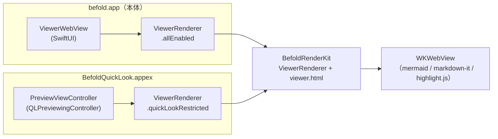
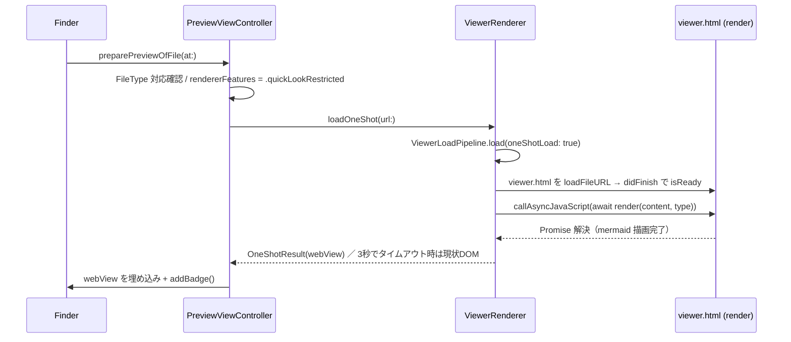

# QuickLook 拡張の仕様と実現方法

<!-- derived-from ./native-app-design.md#モジュール構成 -->

本文書は befold の QuickLook 拡張（`.appex`）が「Finder のスペースキー等でどう
プレビューを描画しているか」を解説する。描画エンジン自体は本体アプリと共有して
おり、その共有機構（`BefoldRenderKit.ViewerRenderer` と `RendererFeatures`）を
中心に説明する。

## 全体像

QuickLook 拡張はレンダリングロジックを一切持たない。描画は本体アプリと同じ
`BefoldRenderKit.ViewerRenderer`（＋ 同梱 `viewer.html`）に委譲し、拡張本体は
「対象ファイルを 1 回だけ描画し、完了を待って返す」薄いホストに徹する。

本体アプリと QuickLook の違いは次の 3 点だけに集約される。

| 観点 | 本体アプリ | QuickLook 拡張 |
|---|---|---|
| ホスト | SwiftUI `ViewerWebView`（`NSViewRepresentable`）経由 | `PreviewViewController` が `ViewerRenderer` を直接保持 |
| 機能プリセット | `RendererFeatures.allEnabled` | `RendererFeatures.quickLookRestricted` |
| 描画 API | 継続描画 `updateContent`（差分描画・段階読込・双方向ブリッジ） | 1 回描画 `loadOneShot` / `renderOnce`（完了を await） |

## appex の構成

主要ファイル: `BefoldApp/BefoldQuickLook/PreviewViewController.swift` /
`Info.plist` / `BefoldQuickLook.entitlements`。

`PreviewViewController: NSViewController, QLPreviewingController` が principal
class で、`preparePreviewOfFile(at:)`（`async throws`）が入口。処理の流れ:

1. `FileType.quickLookSupportedExtensions` に拡張子が含まれるか確認し、含まれ
   なければ `throw CocoaError(.featureUnsupported)` で QuickLook 標準プレビュー
   へ委譲する。UTI 一致だけでは befold 非対応の拡張子が渡りうるため、`FileType`
   分類を単一の情報源としている。
2. `renderer.rendererFeatures = .quickLookRestricted` をセットする。
3. `await renderer.loadOneShot(url:)` で `OneShotResult` を得る。
4. `rejectReason` が非 nil ならメッセージビュー、nil なら `webView` を埋め込み
   `showRenderingIndicatorUntilIdle` を起動する。
5. `addBadge()` で「どの QuickLook 拡張が担当したか＋バージョン」を示すネイティブ
   バッジを前面に載せる（QuickLook は 1 UTI に 1 拡張しか選ばず優先度 API が
   ないため、担当識別用）。

### Info.plist の宣言

`NSExtension` の主なキー:

- `NSExtensionPointIdentifier` = `com.apple.quicklook.preview`
- `NSExtensionPrincipalClass` = `$(PRODUCT_MODULE_NAME).PreviewViewController`
- `NSExtensionAttributes.QLSupportedContentTypes`: mermaid
  （`com.degino.befold.mermaid-diagram`）、markdown 各種、ソースコード各種、
  `public.json/yaml/xml/css/html`、`public.svg-image` など。**PDF・画像は macOS
  標準に委ねるため含めない**。`.ts` は動画 UTI と衝突するため意図的に非宣言。
- `QLSupportsSearchableItems` = `false`、`CFBundlePackageType` = `XPC!`

Info.plist と `FileType` の対応関係は `befoldCLITests/QuickLookInfoPlistTests.swift`
がテストで担保する。

### ターゲット定義（project.yml）

`BefoldApp/project.yml` の `BefoldQuickLook` ターゲット:

- `type: app-extension` / `platform: macOS`、`ENABLE_HARDENED_RUNTIME: true`
- 依存: `BefoldKit`（embed: false）、`BefoldRenderKit`（embed: false）
- `PRODUCT_BUNDLE_IDENTIFIER: com.degino.befold.quicklook`
- `LD_RUNPATH_SEARCH_PATHS: @executable_path/../../../../Frameworks`
  — appex 実行ファイルから 4 階層上のアプリバンドル `Contents/Frameworks` を
  辿ってフレームワークを参照する
- 本体 `befold` ターゲット側で `BefoldQuickLook` を `Contents/PlugIns` へ同梱する

## サンドボックス制約

`BefoldApp/BefoldQuickLook/BefoldQuickLook.entitlements` は 3 キーのみ:

| entitlement | 意味 |
|---|---|
| `com.apple.security.app-sandbox` | サンドボックス有効 |
| `com.apple.security.files.user-selected.read-only` | QuickLook が渡す**対象ファイル単体**の read のみ。親ディレクトリ・兄弟ファイルは読めない |
| `com.apple.security.network.client` | WKWebView はローカルコンテンツのみでも WebKit の Networking プロセスを起動する。サンドボックス下でこれが無いと Networking→WebContent プロセスが連鎖起動できず、ロードが完了せず空白になる |

`network.client` は**プロセス起動のためだけ**に付与しており、外部通信自体は
`viewer.html` 側の CSP と `rendererFeatures = .quickLookRestricted` で塞ぐ（多層
防御）。この「対象ファイル単体しか読めない」制約が、次節の `RendererFeatures`
プリセットの設計理由になっている。

## RendererFeatures による本体との差分吸収

<!-- constrained-by #サンドボックス制約 -->

`BefoldApp/BefoldKit/RendererFeatures.swift`。3 つのフラグでホスト間の差を吸収する。

| フラグ | 有効時に要求する権限 | 意味 |
|---|---|---|
| `allowDirectHTML` | 親ディレクトリ read | HTML を `loadFileURL` で直接ロードする |
| `embedImages` | 兄弟ファイル read | Markdown 内のローカル画像を data URI に埋め込む |
| `allowsInteractiveBridging` | — | `referenceActivated` / `loadMoreLines` などの双方向ブリッジ |

- `.allEnabled` = 全 true（本体アプリ）
- `.quickLookRestricted` = 全 false（QuickLook）

QuickLook では、サンドボックスで**そもそも読めない**兄弟ファイルや親ディレクトリ
への read をレンダラ側が要求しないよう、機能プリセットとサンドボックス制約が
一対一で対応している。`allowsInteractiveBridging == false` のとき、
`ViewerRenderer.makeWebView` は `loadMoreLines` / `referenceActivated` /
`resolveReferences` の postMessage ハンドラを**そもそも登録しない**ため、XSS が
postMessage を呼んでも Swift 側には届かない。

## ViewerRenderer の共有

`BefoldApp/BefoldRenderKit/ViewerRenderer.swift`（＋ `ViewerRenderer+*.swift`
拡張群）。`@MainActor public final class ViewerRenderer: NSObject,
WKNavigationDelegate, WKScriptMessageHandler`。責務は「WKWebView の構成・
`viewer.html` ロード・`render()` 評価を担う WKWebView ドライバ」。

`makeWebView(...)` の要点:

- `ViewerBridge` の各種 userScript（初期ズーム・フォント・検索オプション・
  `hostFeaturesScript` など）を `atDocumentStart` / `forMainFrameOnly` で注入する
- postMessage ハンドラは `messageHandlerNames(for: rendererFeatures)` が返す名前
  だけを登録する（前述のとおり制限モードでは対話系を登録しない）
- BefoldKit リソースバンドルの `viewer.html` を
  `loadFileURL(_:allowingReadAccessTo: resourceDir)` でロードする
- `webView(_:didFinish:)` で `isReady = true` にし、保留していた `pendingUpdate`
  を実行する。これがロード完了ゲートで、本体の `updateContent` と QuickLook の
  `renderOnce` の双方が共有する

本体アプリ側の `ViewerWebView`（`BefoldApp/befold/Viewer/ViewerWebView.swift`）は
レンダリングロジックを持たず、`makeCoordinator()` で `ViewerRenderer` を生成して
橋渡しするだけの薄い `NSViewRepresentable` である（描画エンジンは QuickLook と
完全共有で、重複実装ではない）。

## OneShot 描画完了検知

<!-- derived-from #viewerrenderer-の共有 -->

`BefoldApp/BefoldRenderKit/ViewerRenderer+OneShot.swift` と
`BefoldApp/BefoldKit/ViewerBridge.swift`。QuickLook は「描画が終わったこと」を
確実に待ってから静止画を返す必要がある。継続描画の fire-and-forget な
`evaluateJavaScript` とは別に、完了を await できる専用経路を持つ。

`loadOneShot(url:)` の流れ:

1. `ViewerLoadPipeline.load(..., oneShotLoad: true)` で静的に読み込む（1 回描画
   時のテキスト上限は `maxOneShotTextFileSizeBytes = 2MB`）。
2. 結果を値型 `OneShotRender`（content / fileType / rejectReason / truncation）へ
   純変換する。ViewerStore の世代管理・キャッシュを持たない最小構成。
3. `makeWebView` で `viewer.html` を構成する。
4. `rejectReason == nil` のとき `renderOnce(webView:render:)` を await する。

完了検知の核心（`renderOnce`）:

- `ViewerBridge.awaitRenderScript(content:fileType:)` が
  `await render(<json>, '<type>'[, '<lang>']);` を生成する。**JS 側の `render()`
  は async 関数で mermaid 描画完了まで内部で await 済み**なので、返る Promise の
  解決がそのまま描画完了を意味する（別途の完了通知機構が要らない、という契約）。
- Swift 側は `callAsyncJavaScript(...)` でこの Promise を await する。
- タイムアウト保険: `oneShotRenderTimeout`（既定 3 秒）。`OneShotCompletion`
  （1 回だけ resume できる箱）で「描画完了」と「タイムアウト」のどちらが先でも
  安全に continuation を解決する。超過時はその時点の DOM のまま完了扱いとする。
- `requestAnimationFrame` でペイントまでは**待たない**。rAF はウィンドウに載って
  いない WebView では発火せず、待つと常にタイムアウトまで待たされるため、DOM
  更新完了をもって完了とみなす。

`PreviewViewController.showRenderingIndicatorUntilIdle` は別レイヤーの保険で、
`loadOneShot` のタイムアウト内に終わらず空白放置される場合に「描画中」表示を出し、
`await webView.evaluateJavaScript("1")` が返った時点（JS メインスレッドが空いた
＝描画終了）でインジケータを外す。

