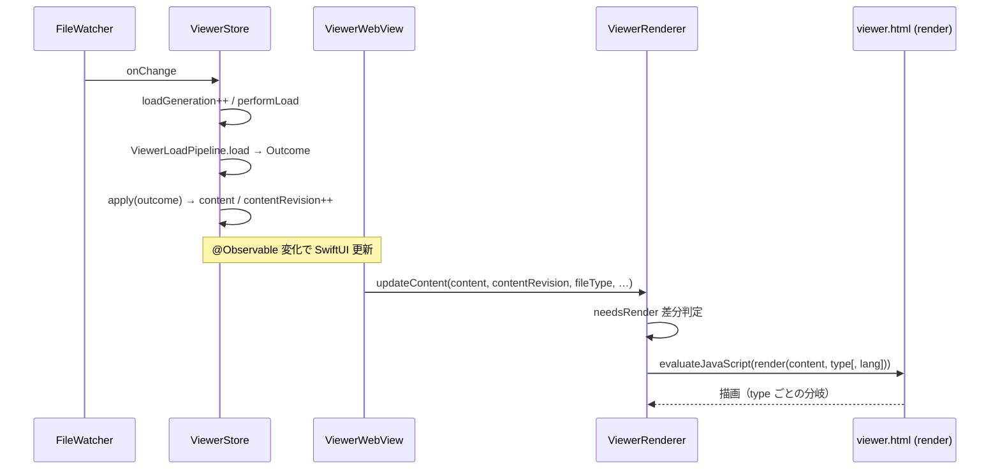

# ビューア描画データフロー（ファイル種別ごとの差異）

<!-- derived-from ./native-app-design.md#表示仕様 -->
<!-- constrained-by ./text-loading-dataflow.md -->

本文書は「読み込んだコンテンツを WKWebView 上でどう描画し分けるか」を、ファイル
種別ごとに解説する。ファイル監視 → `ViewerStore` → WKWebView → `viewer.html` の
JS までを一気通貫で示すことを目的とする。

Swift 側の**読み込み**（チャンク分割・エンコーディング・サイズ制限）の詳細は
[テキスト読み込みデータフロー](./text-loading-dataflow.md)を参照。本文書は
その「読み込んだ後、どのレンダラ・どの同梱アセットで描画するか」を担当する。

## FileType — 種別・レンダラ・同梱アセット対応

`BefoldApp/BefoldKit/FileType.swift`。`enum FileType` は 8 ケース（`mmd /
markdown / svg / html / csv(delimiter:) / image(mimeType:) / pdf /
code(language:)`）。plaintext は独立ケースではなく `.code(language: "plaintext")`
として表現する。拡張子→種別は `typeByExtension`（唯一の情報源）で決まり、未知
拡張子は plaintext へフォールバックする。`jsValue` が JS へ渡す type 文字列。

| FileType | 代表拡張子 | `jsValue` | JS 描画関数 | レンダラ / 同梱アセット |
|---|---|---|---|---|
| `.mmd` | mmd, mermaid | `mmd` | `_renderMmd` → `_mmdRunMermaid` | mermaid.min.js（遅延ロード） |
| `.markdown` | md, markdown | `md` | `_renderMarkdown`（既定分岐） | markdown-it + DOMPurify + highlight.js |
| `.svg` | svg | `svg` | `_renderSvg` | `svgDataURI()` で `` 化（外部ライブラリ無し） |
| `.html` | html, htm | `html` | `_renderHtml`（sandbox iframe） | 無し（別途「直接 HTML モード」あり） |
| `.csv` | csv / tsv | `csv` | `_renderCsv` / `renderCsvSourceHtml` | viewer.js の `parseCsv` / `buildTableHtml`（自前） |
| `.image` | png, jpg, gif, webp, bmp, ico | `image` | `_renderImage` | `imageDataURI()` で base64 ``（自前） |
| `.pdf` | pdf | `pdf` | `_renderPdf` | `base64ToBytes` → Blob → iframe |
| `.code` | swift, py, go, ts, json, yaml…（40+ 種） | `code` | `_renderCode` → `renderCodeHtml` | highlight.min.js |

種別が描画方針を分岐させるプロパティ:

- `isBinaryContent`（`.image` / `.pdf` のみ true）: base64 でバイナリ読込
- `isRenderable`（`.code` 以外 true）: `.code` はソース表示のみでレンダリング切替不可
- `supportsSourceMode`（`isRenderable && !isBinaryContent`）: mmd/md/svg/html/csv が
  ソース ↔ レンダリング切替の対象
- `isChunkable`（`.csv` / `.code` / `.markdown` のみ true）: 行/ブロック単位で段階
  描画できる。mmd/svg/html/image/pdf は全量描画

## 読み込み側の 3 分類（概要）

`BefoldApp/BefoldKit/ViewerLoadPipeline.load(...)` が種別を 3 つに分けて `Outcome`
（`.missing` / `.chunked` / `.full`）を返す。詳細は
[テキスト読み込みデータフロー](./text-loading-dataflow.md)。

| 分類 | 対象 | 読込方法 | サイズ上限 |
|---|---|---|---|
| バイナリ | image / pdf | `ContentLoader.load` で base64 → `.full` | 50MB |
| 非行指向テキスト | mmd / svg / html | 全量読込 → `.full` | 10MB（QuickLook 1 回描画時は 2MB） |
| 行指向テキスト | csv / code / markdown | `StringChunkReader` で先頭チャンク → `.chunked` | 100MB（`NormalizedTextCache.maxFileSizeBytes`。超過時は `fileTooLarge` で reject） |

## viewer.html の JS 分岐

同梱アセットは責務で 2 分割されている。

- `BefoldApp/BefoldKit/Resources/viewer.js`: **純粋ロジックのみ**（DOM 非依存・
  Node でテスト可能）。トークナイザ・HTML 組み立て・ズーム計算などのヘルパー群。
- `BefoldApp/BefoldKit/Resources/viewer-main.js`: 実際の DOM 描画と type ディス
  パッチ。

`async function render(content, type, lang)`（viewer-main.js）が描画の起点。
`#diagram-wrap` からクラスを一括除去 → 前回 PDF blob を解放 → type で分岐する。

| type | ビルダー | viewer.js ヘルパー |
|---|---|---|
| `mmd` | `_renderMmd`（`<pre class="mermaid">`） | `mermaidTheme` |
| `svg` | `_renderSvg`（img + zoom wrap） | `svgDataURI` |
| `html` | `_renderHtml`（sandbox iframe, srcdoc） | — |
| `csv` | `_renderCsv`（table） | `parseCsv`, `buildTableHtml` |
| `image` | `_renderImage`（fit + img） | `imageDataURI`, `imageFitSize` |
| `pdf` | `_renderPdf`（blob iframe） | `base64ToBytes` |
| `code` | `_renderCode` | `renderCodeHtml`（highlightCode + 行番号 table） |
| 既定（md 等） | `_renderMarkdown`（`md.render` + DOMPurify） | `sanitizeRenderedHtml`, `highlightCode` |

分岐後、全種別共通で `await _mmdRunMermaid()` が走り、Markdown 内の ` ```mermaid `
フェンスも拾って SVG 描画する（mermaid.min.js は初回だけ `_mmdEnsureMermaidLoaded`
で遅延ロード）。その後 `_annotatePathRefs` → `_mmdResolveReferences` → 検索・
ズーム・スクロール復元へ続く。

**ソースモード**: `render` 冒頭で `mode === 'source'` かつ type が code/image/pdf
以外なら `_renderSource` に分流する。CSV は `renderCsvSourceHtml`（レインボー
着色）、それ以外は言語を xml/markdown/plaintext に写像して `renderCodeHtml` する。

**段階読込追記**（`appendChunk`）も type 分岐する: `md` は
`insertAdjacentHTML(md.render(chunk))`、`csv`（テーブル）は `<tbody>` に行追記、
それ以外は `codeChunkInnerHtml`（前方文脈付き highlight.js）で行追記する。
mmd/svg/html/image/pdf は `isChunkable == false` なので `appendChunk` 経路には
来ない。

`viewer.html` は CSP を厳格化（`script-src 'self'`、インライン script 不使用）し、
`viewer.js → markdown-it.min.js → highlight.min.js → dompurify.min.js →
viewer-main.js` の順で同梱アセットを読み込む。mermaid.min.js のみ静的 `<script>`
を置かず遅延ロードする。

## 監視 → Store → WebView → JS の一気通貫

<!-- derived-from ./native-app-design.md#ファイル監視 -->

ファイル変更 1 回が画面更新に至るまでの呼び出しチェーン（関数名レベル）:

```
FileWatcher(onChange:)                         [befold/FileWatching/FileWatcher.swift]
  ▼
ViewerStore.loadContent()  → loadGeneration++  [befold/Viewer/ViewerStore.swift]
  └ Task → performLoad(...)
        └ await ViewerLoadPipeline.load(...) → Outcome
        └ guard generation == loadGeneration        （stale 破棄）
        └ apply(outcome:...)
              ├ .chunked → content=firstChunk, contentRevision++, isTruncated
              ├ .full    → content=loaded.content, contentRevision++
              └ onContentReloaded?()                （ツールバー同期）
  ▼  @Observable の content / contentRevision / fileType / isTruncated が変化
SwiftUI 更新サイクル
ViewerWebView.updateNSView(...)                [befold/Viewer/ViewerWebView.swift]
  └ renderer.updateContent(content, contentRevision:, fileType:, ...)
ViewerRenderer.updateContent(...)              [BefoldRenderKit/ViewerRenderer+ContentUpdate.swift]
  ├ shouldEnterDirectHTMLMode → webView.load / loadFileURL   （HTML 直接ロード）
  ├ pendingAppend あり → applyAppend(...)                    （段階読込追記）
  └ needsRender(差分あり) → applyRender(...)
ViewerRenderer.applyRender(...)                [BefoldRenderKit/ViewerRenderer+RenderHelpers.swift]
  ├ evaluateJavaScript(lineNumbersScript / viewModeScript / truncatedScript / restoreScrollPositionScript)
  └ evaluateJavaScript(renderScript(content, fileType))  → JS: render(content, type[, lang])
```



段階読込（「続きを読み込む」）: JS のボタン → postMessage `loadMoreLines` →
`ViewerRenderer.handleLoadMoreLines()` → `delegate.rendererDidRequestMoreLines`
→ `ViewerStore.loadMoreLines()`（content 追記・contentRevision++）→ 再び
`updateContent` → `applyAppend` → `evaluateJavaScript(appendChunkScript)`
→ JS: `appendChunk(chunk, type[, lang])`。

## JS 契約の単一情報源: ViewerBridge

`BefoldApp/BefoldKit/ViewerBridge.swift` が Swift → JS の関数名・メッセージ名を
一元管理する（`ViewerBridgeTests` が `viewer.html` 側定義と突合する）。

- 描画呼び出しの組み立て: `renderScript` / `appendChunkScript` は
  `contentCallScript(function:content:fileType:)` に集約し、
  `fn(<JSON化content>, '<jsValue>'[, '<lang>'])` を生成する。`lang` は
  `FileType.renderLangArgument`（code=言語名 / csv=区切り文字 / image=MIME）のみ。
  content は `JSONEncoder` でエスケープし JS インジェクションを防ぐ。
- JS → Swift メッセージ: `scrollPositionChanged` / `zoomChanged` /
  `referenceActivated` / `loadMoreLines` / `resolveReferences` /
  `findOptionsChanged`。ペイロードキーは `PayloadKey` 列挙で契約化する。
- `awaitRenderScript`（`callAsyncJavaScript` 用）は QuickLook の 1 回描画ホストが
  render 完了を await するために使う（[QuickLook 拡張](./quicklook.md#oneshot-描画完了検知)参照）。

Markdown 内ローカル画像の data URI 化などの content 前処理は
`ViewerRenderer.renderableContent(...)`（`MarkdownImageEmbedder`）を通してから
`renderScript` に渡される。
