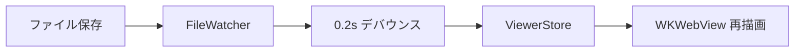

# ダイアグラム個別ズーム 実装計画

> **For agentic workers:** REQUIRED SUB-SKILL: Use superpowers:subagent-driven-development (recommended) or superpowers:executing-plans to implement this plan task-by-task. Steps use checkbox (`- [ ]`) syntax for tracking.

**Goal:** ズームボタンの操作対象を「HTML 全体」から「mermaid ダイアグラム個別」に変更する。右上固定パネルを削除し、各ダイアグラムにホバー表示の `[− % +]` コントロールを付ける。

**Architecture:** レンダリング後に各 `.mermaid` 要素を `overflow: auto` のラッパーで包み、内側に CSS `zoom` を適用（枠は 100% 時サイズで固定、拡大時は枠内スクロール）。メニュー / Cmd± の全体ズーム（`#diagram-wrap` への CSS `zoom` + ZoomStore 永続化）は無変更。Ctrl+ホイール / ピンチはポインタ直下がダイアグラムか否かで振り分ける。

**Tech Stack:** viewer.html 内の素の JavaScript（ES5 スタイル: `var` + function 宣言）、viewer.js（jest でテストする純粋関数）、style.css。Swift 側は変更しない。

**Spec:** `docs/superpowers/specs/2026-07-04-diagram-zoom-design.md`

## Global Constraints

- 全体ズーム: 範囲 50%〜200%、25% 刻み、ファイル毎に UserDefaults 永続化（すべて現状維持）
- ダイアグラムズーム: 範囲 50%〜300%、25% 刻み、永続化なし（セッション内の JS 変数のみ、再レンダリングでは維持）
- Swift ファイル（ZoomStore / MainMenuBuilder / ViewerWindowController / ViewerWebView）は変更禁止
- viewer.html の CSP は変更しない（外部リソース追加禁止。動的生成要素のイベントは `addEventListener` で付ける）
- 既存コードのイディオムに合わせる: `var` + function 宣言、識別子は `_mmd` プレフィックス
- コミットは Conventional Commits + 日本語、末尾に `Co-Authored-By: Claude Fable 5 <noreply@anthropic.com>`
- テストコマンド: `cd MmdviewApp && npm test`（jest）、ビルドは `cd MmdviewApp && swift build`

---

### Task 1: viewer.js — ズーム純粋関数に上限引数を追加

`clampZoom` / `stepZoom` / `wheelZoom` に省略可能な `max` 引数を追加し、ダイアグラム用上限定数 `DIAGRAM_ZOOM_MAX = 3.0` を追加する。省略時は既存の `ZOOM_MAX`（2.0）で、既存呼び出しの挙動は変わらない。

**Files:**
- Modify: `MmdviewApp/mmdview/Resources/viewer.js`
- Test: `MmdviewApp/mmdview/Resources/__tests__/viewer.test.js`

**Interfaces:**
- Consumes: 既存の `ZOOM_MIN` / `ZOOM_MAX` / `ZOOM_STEP` / `clampZoom(z)` / `stepZoom(current, delta)` / `wheelZoom(current, deltaY)`
- Produces: `DIAGRAM_ZOOM_MAX`（Number, 3.0）、`clampZoom(z, max?)` / `stepZoom(current, delta, max?)` / `wheelZoom(current, deltaY, max?)`（`max` 省略時は `ZOOM_MAX`。Task 3 / 4 がダイアグラムズームで `DIAGRAM_ZOOM_MAX` を渡して使う）

- [ ] **Step 1: 失敗するテストを書く**

`MmdviewApp/mmdview/Resources/__tests__/viewer.test.js` の `require` に `DIAGRAM_ZOOM_MAX` を追加する:

```js
const {
  ZOOM_MIN,
  ZOOM_MAX,
  ZOOM_STEP,
  ZOOM_DEFAULT,
  BASE_SCALE,
  DIAGRAM_ZOOM_MAX,
  clampZoom,
  stepZoom,
  wheelZoom,
  zoomLabel,
  effectiveZoom,
  parseStoredZoom,
  mermaidTheme,
  sanitizeLang,
  highlightCode,
} = require('../viewer');
```

ファイル末尾に以下の describe ブロックを追加する:

```js
describe('DIAGRAM_ZOOM_MAX', () => {
  test('is 3.0 and above ZOOM_MAX', () => {
    expect(DIAGRAM_ZOOM_MAX).toBe(3.0);
    expect(DIAGRAM_ZOOM_MAX).toBeGreaterThan(ZOOM_MAX);
  });

  test('ZOOM_STEP divides diagram range evenly from default', () => {
    const stepsUp = (DIAGRAM_ZOOM_MAX - ZOOM_DEFAULT) / ZOOM_STEP;
    expect(Number.isInteger(stepsUp)).toBe(true);
  });
});

describe('clampZoom with custom max', () => {
  test('allows values above ZOOM_MAX up to the given max', () => {
    expect(clampZoom(2.5, DIAGRAM_ZOOM_MAX)).toBe(2.5);
    expect(clampZoom(3.0, DIAGRAM_ZOOM_MAX)).toBe(3.0);
  });

  test('clamps above the given max', () => {
    expect(clampZoom(3.5, DIAGRAM_ZOOM_MAX)).toBe(DIAGRAM_ZOOM_MAX);
  });

  test('still clamps at ZOOM_MIN', () => {
    expect(clampZoom(0.1, DIAGRAM_ZOOM_MAX)).toBe(ZOOM_MIN);
  });

  test('defaults to ZOOM_MAX when max is omitted (existing behavior)', () => {
    expect(clampZoom(2.5)).toBe(ZOOM_MAX);
  });
});

describe('stepZoom with custom max', () => {
  test('steps beyond 200% up to 300%', () => {
    expect(stepZoom(2.0, ZOOM_STEP, DIAGRAM_ZOOM_MAX)).toBe(2.25);
    expect(stepZoom(2.75, ZOOM_STEP, DIAGRAM_ZOOM_MAX)).toBe(3.0);
  });

  test('clamps at the given max', () => {
    expect(stepZoom(3.0, ZOOM_STEP, DIAGRAM_ZOOM_MAX)).toBe(DIAGRAM_ZOOM_MAX);
  });

  test('defaults to ZOOM_MAX when max is omitted (existing behavior)', () => {
    expect(stepZoom(2.0, ZOOM_STEP)).toBe(ZOOM_MAX);
  });
});

describe('wheelZoom with custom max', () => {
  test('zooms in beyond 200% with custom max', () => {
    expect(wheelZoom(2.0, -25, DIAGRAM_ZOOM_MAX)).toBe(2.25);
  });

  test('clamps at the given max', () => {
    expect(wheelZoom(3.0, -100, DIAGRAM_ZOOM_MAX)).toBe(DIAGRAM_ZOOM_MAX);
  });

  test('defaults to ZOOM_MAX when max is omitted (existing behavior)', () => {
    expect(wheelZoom(2.0, -100)).toBe(ZOOM_MAX);
  });
});
```

- [ ] **Step 2: テストが失敗することを確認する**

Run: `cd MmdviewApp && npm test`
Expected: FAIL — `DIAGRAM_ZOOM_MAX` が undefined（`is 3.0 and above ZOOM_MAX` などが落ちる）

- [ ] **Step 3: 最小実装を書く**

`MmdviewApp/mmdview/Resources/viewer.js` の定数ブロック（`var BASE_SCALE = 0.75;` の直後）に追加:

```js
// ダイアグラム個別ズームの上限。全体ズーム(ZOOM_MAX)より広く取り、細部の確認に使う。
var DIAGRAM_ZOOM_MAX = 3.0;
```

`clampZoom` / `stepZoom` / `wheelZoom` を以下に置き換える（`max` 省略時は従来どおり `ZOOM_MAX`）:

```js
function clampZoom(z, max) {
  if (max === undefined) { max = ZOOM_MAX; }
  return Math.max(ZOOM_MIN, Math.min(max, z));
}

function stepZoom(current, delta, max) {
  return clampZoom(Math.round((current + delta) * 100) / 100, max);
}

function wheelZoom(current, deltaY, max) {
  return clampZoom(Math.round((current - deltaY * 0.01) * 1000) / 1000, max);
}
```

`module.exports` に `DIAGRAM_ZOOM_MAX: DIAGRAM_ZOOM_MAX,` を追加する（`BASE_SCALE` の行の直後）。

- [ ] **Step 4: テストが通ることを確認する**

Run: `cd MmdviewApp && npm test`
Expected: PASS（既存テスト含め全件）

- [ ] **Step 5: コミット**

```bash
git add MmdviewApp/mmdview/Resources/viewer.js MmdviewApp/mmdview/Resources/__tests__/viewer.test.js
git commit -m "feat: ズーム純粋関数に上限引数とダイアグラム用上限を追加する

Co-Authored-By: Claude Fable 5 <noreply@anthropic.com>"
```

---

### Task 2: 右上固定ズームパネルの削除

全体ズームの操作手段をメニュー / Cmd± / Ctrl+ホイールだけにし、右上の固定パネル UI を削除する。`_mmdApplyZoom()` からパネル要素への参照を取り除く（取り除かないと `getElementById(...)` が null になり例外で全体ズームが壊れる）。

**Files:**
- Modify: `MmdviewApp/mmdview/Resources/viewer.html`（body 内の `.zoom-controls` div と `_mmdApplyZoom`）
- Modify: `MmdviewApp/mmdview/Resources/style.css`（`.zoom-controls` / `#zoom-label` のスタイル一式）

**Interfaces:**
- Consumes: なし
- Produces: `_mmdApplyZoom()` は「`#diagram-wrap` への zoom 適用 + zoomChanged 通知」だけを行う（Task 3 以降もこの契約のまま）。`_mmdZoomIn` / `_mmdZoomOut` / `_mmdZoomReset` / `_mmdWheelZoom` は無変更で残る（メニューと Cmd± が呼ぶ）

- [ ] **Step 1: viewer.html から固定パネルの HTML を削除する**

body 内の以下の 5 行を削除する:

```html
  <div class="zoom-controls">
    <button id="zoom-out" title="縮小 (Cmd −)" onclick="_mmdZoomOut()">−</button>
    <span id="zoom-label" title="クリックでリセット" onclick="_mmdZoomReset()">100%</span>
    <button id="zoom-in" title="拡大 (Cmd +)" onclick="_mmdZoomIn()">+</button>
  </div>
```

- [ ] **Step 2: `_mmdApplyZoom` からパネル要素の参照を削除する**

現在の実装:

```js
  function _mmdApplyZoom() {
    _mmdZoom = clampZoom(_mmdZoom);
    document.getElementById('diagram-wrap').style.zoom = effectiveZoom(_mmdZoom);
    document.getElementById('zoom-label').textContent = zoomLabel(_mmdZoom);
    document.getElementById('zoom-in').disabled = _mmdZoom >= ZOOM_MAX;
    document.getElementById('zoom-out').disabled = _mmdZoom <= ZOOM_MIN;
    if (_mmdZoom !== _mmdLastPostedZoom &&
        window.webkit && window.webkit.messageHandlers && window.webkit.messageHandlers.zoomChanged) {
      window.webkit.messageHandlers.zoomChanged.postMessage(_mmdZoom);
      _mmdLastPostedZoom = _mmdZoom;
    }
  }
```

これを以下に置き換える（`zoom-label` / `zoom-in` / `zoom-out` の 3 行を削除するだけ）:

```js
  function _mmdApplyZoom() {
    _mmdZoom = clampZoom(_mmdZoom);
    document.getElementById('diagram-wrap').style.zoom = effectiveZoom(_mmdZoom);
    if (_mmdZoom !== _mmdLastPostedZoom &&
        window.webkit && window.webkit.messageHandlers && window.webkit.messageHandlers.zoomChanged) {
      window.webkit.messageHandlers.zoomChanged.postMessage(_mmdZoom);
      _mmdLastPostedZoom = _mmdZoom;
    }
  }
```

- [ ] **Step 3: style.css から固定パネルのスタイルを削除する**

以下のルールを丸ごと削除する: `.zoom-controls`、`.zoom-controls button`、`.zoom-controls button:hover`、`.zoom-controls button:disabled`、`.zoom-controls button:disabled:hover`、`#zoom-label`、`#zoom-label:hover`（style.css の 85〜142 行のブロック群）。

`.mmd-deleted-banner` 以降は変更しない。

- [ ] **Step 4: 検証**

Run: `cd MmdviewApp && npm test && swift build`
Expected: jest 全件 PASS、`Build complete!`

viewer.html に `zoom-label` / `zoom-controls` への参照が残っていないことを確認:

Run: `grep -n "zoom-label\|zoom-controls\|zoom-in\|zoom-out" MmdviewApp/mmdview/Resources/viewer.html MmdviewApp/mmdview/Resources/style.css`
Expected: ヒットなし（exit code 1）

- [ ] **Step 5: コミット**

```bash
git add MmdviewApp/mmdview/Resources/viewer.html MmdviewApp/mmdview/Resources/style.css
git commit -m "feat: 右上固定ズームパネルを削除する

Co-Authored-By: Claude Fable 5 <noreply@anthropic.com>"
```

---

### Task 3: ダイアグラムラッパーとホバーコントロール

レンダリング後に各 `.mermaid` 要素をラッパーで包み、ホバーで表示される `[− % +]` コントロールで個別ズームできるようにする。DOM 構造:

```
.diagram-zoom-wrap        position:relative（コントロールの位置基準）
├ .diagram-zoom-scroll    overflow:auto、高さ=100%時の実測値で固定
│ └ .diagram-zoom-inner   CSS zoom の適用対象
│   └ pre.mermaid         （レンダリング済み SVG）
└ .diagram-zoom-controls  ホバーで表示。scroll の外なのでスクロールに追従せず右上に固定
```

**Files:**
- Modify: `MmdviewApp/mmdview/Resources/viewer.html`（`// --- Zoom ---` セクションの直後にダイアグラムズームのセクションを追加、`render()` にラッパー生成呼び出しを追加）
- Modify: `MmdviewApp/mmdview/Resources/style.css`（ラッパー・コントロールのスタイルを追加）

**Interfaces:**
- Consumes: Task 1 の `stepZoom(current, delta, max)` / `wheelZoom(current, deltaY, max)` / `DIAGRAM_ZOOM_MAX`、既存の `ZOOM_DEFAULT` / `ZOOM_MIN` / `ZOOM_STEP` / `zoomLabel(zoom)` / `effectiveZoom(zoom)`
- Produces: `_mmdWrapDiagrams(diagramWrap)`（render() 末尾から呼ぶ）、`_mmdDiagramWheelZoom(wrap, deltaY)`（Task 4 のホイール分岐が呼ぶ。`wrap` は `.diagram-zoom-wrap` 要素）

- [ ] **Step 1: viewer.html にダイアグラムズームの JS を追加する**

`// --- Mermaid ---` コメントの直前（`document.addEventListener('wheel', ...)` の登録の後）に以下のセクションを挿入する:

```js
  // --- Diagram Zoom（ダイアグラム個別ズーム）---
  // ブロック順インデックス → ズーム倍率。セッション内のみ保持し、再レンダリング
  // をまたいで維持する（永続化はしない。ウィンドウを閉じるとリセット）。
  // markdown 編集でブロックの順番が変わるとズームが別のダイアグラムに付くが、
  // 影響がセッション内に限られるため許容する（設計書参照）。
  var _diagramZooms = new Map();

  function _mmdDiagramZoomValue(index) {
    return _diagramZooms.has(index) ? _diagramZooms.get(index) : ZOOM_DEFAULT;
  }

  function _mmdApplyDiagramZoom(wrap) {
    var index = Number(wrap.dataset.diagramIndex);
    var zoom = _mmdDiagramZoomValue(index);
    wrap.querySelector('.diagram-zoom-inner').style.zoom = zoom;
    wrap.querySelector('.diagram-zoom-label').textContent = zoomLabel(zoom);
    wrap.querySelector('.diagram-zoom-in').disabled = zoom >= DIAGRAM_ZOOM_MAX;
    wrap.querySelector('.diagram-zoom-out').disabled = zoom <= ZOOM_MIN;
  }

  function _mmdDiagramZoomStep(wrap, delta) {
    var index = Number(wrap.dataset.diagramIndex);
    _diagramZooms.set(index, stepZoom(_mmdDiagramZoomValue(index), delta, DIAGRAM_ZOOM_MAX));
    _mmdApplyDiagramZoom(wrap);
  }

  function _mmdDiagramZoomReset(wrap) {
    _diagramZooms.set(Number(wrap.dataset.diagramIndex), ZOOM_DEFAULT);
    _mmdApplyDiagramZoom(wrap);
  }

  function _mmdDiagramWheelZoom(wrap, deltaY) {
    var index = Number(wrap.dataset.diagramIndex);
    _diagramZooms.set(index, wheelZoom(_mmdDiagramZoomValue(index), deltaY, DIAGRAM_ZOOM_MAX));
    _mmdApplyDiagramZoom(wrap);
  }

  // CSP により動的生成要素へ onclick 属性は使わず addEventListener で配線する。
  function _mmdBuildDiagramControls(wrap) {
    var controls = document.createElement('div');
    controls.className = 'diagram-zoom-controls';
    var zoomOut = document.createElement('button');
    zoomOut.className = 'diagram-zoom-out';
    zoomOut.title = '縮小';
    zoomOut.textContent = '−';
    zoomOut.addEventListener('click', function() { _mmdDiagramZoomStep(wrap, -ZOOM_STEP); });
    var label = document.createElement('span');
    label.className = 'diagram-zoom-label';
    label.title = 'クリックでリセット';
    label.addEventListener('click', function() { _mmdDiagramZoomReset(wrap); });
    var zoomIn = document.createElement('button');
    zoomIn.className = 'diagram-zoom-in';
    zoomIn.title = '拡大';
    zoomIn.textContent = '+';
    zoomIn.addEventListener('click', function() { _mmdDiagramZoomStep(wrap, ZOOM_STEP); });
    controls.appendChild(zoomOut);
    controls.appendChild(label);
    controls.appendChild(zoomIn);
    return controls;
  }

  // 各 .mermaid 要素をズーム用ラッパーで包む。SVG サイズ確定後
  // （mermaid.run() 完了後）に呼ぶこと。
  function _mmdWrapDiagrams(diagramWrap) {
    diagramWrap.querySelectorAll('.mermaid').forEach(function(el, i) {
      var wrap = document.createElement('div');
      wrap.className = 'diagram-zoom-wrap';
      wrap.dataset.diagramIndex = i;
      var scroll = document.createElement('div');
      scroll.className = 'diagram-zoom-scroll';
      var inner = document.createElement('div');
      inner.className = 'diagram-zoom-inner';
      el.parentNode.insertBefore(wrap, el);
      inner.appendChild(el);
      scroll.appendChild(inner);
      wrap.appendChild(scroll);
      wrap.appendChild(_mmdBuildDiagramControls(wrap));
      // 枠を 100% 時の高さで固定し、拡大時は枠内スクロールにする。
      // ビューポート高（.viewer の上下 padding 32px×2 を差し引き）を上限とする。
      // offsetHeight はレイアウト px（祖先の CSS zoom の影響を受けない）なので、
      // 実ピクセルの window.innerHeight は全体ズームぶんを割り戻して比較する。
      var naturalHeight = inner.offsetHeight;
      var viewportCap = (window.innerHeight - 64) / effectiveZoom(_mmdZoom);
      scroll.style.height = Math.min(naturalHeight, viewportCap) + 'px';
      _mmdApplyDiagramZoom(wrap);
    });
  }
```

- [ ] **Step 2: render() からラッパー生成を呼ぶ**

`render()` 内の mermaid 描画ブロック:

```js
    var mermaidElements = diagramWrap.querySelectorAll('.mermaid');
    if (mermaidElements.length > 0) {
      mermaidElements.forEach(function(el, i) {
        el.removeAttribute('data-processed');
        el.id = 'mmd-' + i + '-' + Date.now();
      });
      try {
        await mermaid.run({ nodes: Array.from(mermaidElements) });
      } catch(e) {
        // parseError callback handles display
      }
    }
```

これを以下に置き換える（`_mmdWrapDiagrams` の呼び出しを追加するだけ）:

```js
    var mermaidElements = diagramWrap.querySelectorAll('.mermaid');
    if (mermaidElements.length > 0) {
      mermaidElements.forEach(function(el, i) {
        el.removeAttribute('data-processed');
        el.id = 'mmd-' + i + '-' + Date.now();
      });
      try {
        await mermaid.run({ nodes: Array.from(mermaidElements) });
      } catch(e) {
        // parseError callback handles display
      }
      _mmdWrapDiagrams(diagramWrap);
    }
```

- [ ] **Step 3: style.css にラッパー・コントロールのスタイルを追加する**

ファイル末尾に追加する（ガラス調の変数は既存の `--panel-*` / `--btn-*` を流用）:

```css
/*
  ダイアグラム個別ズーム。
  .diagram-zoom-wrap が position:relative でコントロールの位置基準を持ち、
  .diagram-zoom-scroll（overflow:auto、高さは JS が 100% 時の実測値で固定）の
  外にコントロールを置くことで、枠内スクロールに追従せず右上に留まる。
*/
.diagram-zoom-wrap {
  position: relative;
  max-width: 100%;
}

.diagram-zoom-scroll {
  overflow: auto;
}

/* CSS zoom の適用対象。max-content で拡大後の実寸が scroll のスクロール領域になる */
.diagram-zoom-inner {
  width: max-content;
}

/* 枠の高さ実測(offsetHeight)に pre の margin が入らないため 0 にする */
.diagram-zoom-inner pre.mermaid {
  margin: 0;
}

/* markdown 本文中では通常の pre と同じ下マージンをラッパー側に持たせる */
.markdown-body .diagram-zoom-wrap {
  margin-bottom: 16px;
}

.diagram-zoom-controls {
  position: absolute;
  top: 8px;
  right: 8px;
  display: flex;
  align-items: center;
  gap: 4px;
  background: var(--panel-bg);
  backdrop-filter: blur(8px);
  -webkit-backdrop-filter: blur(8px);
  border: 1px solid var(--panel-border);
  border-radius: 8px;
  padding: 4px 8px;
  box-shadow: 0 1px 4px var(--panel-shadow);
  font-size: 13px;
  user-select: none;
  opacity: 0;
  pointer-events: none;
  transition: opacity 0.15s ease;
}

.diagram-zoom-wrap:hover .diagram-zoom-controls {
  opacity: 1;
  pointer-events: auto;
}

.diagram-zoom-controls button {
  width: 22px;
  height: 22px;
  border: none;
  background: none;
  cursor: pointer;
  font-size: 16px;
  color: var(--btn-fg);
  border-radius: 4px;
  display: flex;
  align-items: center;
  justify-content: center;
  line-height: 1;
}

.diagram-zoom-controls button:hover {
  background: var(--btn-hover-bg);
}

.diagram-zoom-controls button:disabled {
  color: var(--btn-disabled-fg);
  cursor: default;
}

.diagram-zoom-controls button:disabled:hover {
  background: none;
}

.diagram-zoom-label {
  min-width: 40px;
  text-align: center;
  color: var(--fg-muted);
  cursor: pointer;
}

.diagram-zoom-label:hover {
  color: var(--accent);
}
```

- [ ] **Step 4: 検証**

Run: `cd MmdviewApp && npm test && swift build`
Expected: jest 全件 PASS、`Build complete!`

動作確認（アプリ起動して目視。`swift build` は .app を生成しないため xcodebuild を使う）:

```bash
cd MmdviewApp && xcodegen generate && \
  xcodebuild build -scheme mmdview -configuration Debug -derivedDataPath .build/xcode -quiet && \
  open -a .build/xcode/Build/Products/Debug/mmdview.app ../sample/flowchart.mmd
```

Expected: ダイアグラムにマウスを乗せると右上に `[− 100% +]` が現れ、`+` で図だけが拡大し枠内スクロールになる。％クリックで 100% に戻る。確認したらアプリを終了する。

- [ ] **Step 5: コミット**

```bash
git add MmdviewApp/mmdview/Resources/viewer.html MmdviewApp/mmdview/Resources/style.css
git commit -m "feat: mermaid ダイアグラムに個別ズームのホバーコントロールを追加する

Co-Authored-By: Claude Fable 5 <noreply@anthropic.com>"
```

---

### Task 4: Ctrl+ホイール / ピンチのポインタ位置分岐

macOS トラックパッドのピンチは `ctrlKey: true` の `wheel` イベントとして届く。ポインタ直下がダイアグラム（`.diagram-zoom-wrap` 内）ならそのダイアグラムの個別ズーム、それ以外は従来どおり全体ズームに振り分ける。

**Files:**
- Modify: `MmdviewApp/mmdview/Resources/viewer.html`（既存の `wheel` リスナー 1 箇所）

**Interfaces:**
- Consumes: Task 3 の `_mmdDiagramWheelZoom(wrap, deltaY)`、既存の `_mmdWheelZoom(deltaY)`
- Produces: なし（最終タスク前の仕上げ）

- [ ] **Step 1: wheel リスナーを分岐版に置き換える**

現在の実装:

```js
  document.addEventListener('wheel', function(e) {
    if (e.ctrlKey) { e.preventDefault(); _mmdWheelZoom(e.deltaY); }
  }, { passive: false });
```

これを以下に置き換える:

```js
  // Ctrl+ホイール（トラックパッドのピンチ含む）はポインタ位置で振り分ける:
  // ダイアグラム上ならそのダイアグラムの個別ズーム、それ以外は全体ズーム。
  document.addEventListener('wheel', function(e) {
    if (!e.ctrlKey) { return; }
    e.preventDefault();
    var wrap = e.target instanceof Element ? e.target.closest('.diagram-zoom-wrap') : null;
    if (wrap) {
      _mmdDiagramWheelZoom(wrap, e.deltaY);
    } else {
      _mmdWheelZoom(e.deltaY);
    }
  }, { passive: false });
```

注意: このリスナーは Task 3 で追加した `_mmdDiagramWheelZoom` の定義より前（`// --- Zoom ---` セクション）にあるが、呼び出しはイベント発火時なので定義順の問題はない。

- [ ] **Step 2: 検証**

Run: `cd MmdviewApp && npm test && swift build`
Expected: jest 全件 PASS、`Build complete!`

動作確認（アプリ起動して目視）:

```bash
cd MmdviewApp && xcodegen generate && \
  xcodebuild build -scheme mmdview -configuration Debug -derivedDataPath .build/xcode -quiet && \
  open -a .build/xcode/Build/Products/Debug/mmdview.app ../sample/sample.md
```

Expected: ダイアグラム上で Ctrl+ホイール（またはピンチ）→ 図だけ拡縮。本文の上で Ctrl+ホイール → ページ全体が拡縮。確認したらアプリを終了する。

- [ ] **Step 3: コミット**

```bash
git add MmdviewApp/mmdview/Resources/viewer.html
git commit -m "feat: Ctrl+ホイールをポインタ位置でダイアグラムと全体ズームに振り分ける

Co-Authored-By: Claude Fable 5 <noreply@anthropic.com>"
```

---

### Task 5: サンプル拡充とスモークテスト

複数ダイアグラムの個別ズームを確認できるよう sample.md に 2 個目の mermaid ブロックを追加し、設計書のチェックリストでスモークテストを行う。

**Files:**
- Modify: `sample/sample.md`

**Interfaces:**
- Consumes: Task 1〜4 の全成果
- Produces: なし（検証タスク）

- [ ] **Step 1: sample.md に 2 個目の mermaid ブロックを追加する**

`sample/sample.md` の最初の mermaid ブロック（sequenceDiagram）の閉じフェンスの後に、本文を 1 段落はさんで以下を追加する:

````markdown
ファイル変更は同一プロセス内で伝搬する。全体の流れは次のとおり。


````

- [ ] **Step 2: ビルドして起動する**

```bash
cd MmdviewApp && npm test && xcodegen generate && \
  xcodebuild build -scheme mmdview -configuration Debug -derivedDataPath .build/xcode -quiet && \
  open -a .build/xcode/Build/Products/Debug/mmdview.app ../sample/sample.md
```

Expected: jest 全件 PASS、ビルド成功、アプリが起動して sample.md が表示される

- [ ] **Step 3: 設計書のスモークチェックリストを実施する**

`docs/superpowers/specs/2026-07-04-diagram-zoom-design.md` の「テスト」節に従い、以下を目視確認する:

1. `sample/flowchart.mmd` を開く: ホバーボタンで拡大 → 枠内スクロールできる。枠はウィンドウを超えない
2. `sample/sample.md` を開く: 2 個の mermaid ブロックを個別にズームでき、本文レイアウトが動かない（本文が押し出されない）
3. Cmd± で全体ズーム（markdown 本文も拡縮）し、ウィンドウを閉じて開き直すと倍率が復元される
4. ダイアグラム上の Ctrl+ホイールは図だけ、本文上の Ctrl+ホイールは全体が拡縮する
5. sample.md をエディタで編集・保存 → 自動再描画後もダイアグラムの個別ズームが維持される
6. ダークモード切替でも表示が崩れない（コントロールのガラス調がダーク配色になる）

問題があれば該当タスクに戻って修正し、修正は当該タスクのコミットに `git commit --amend` でまとめる（未 push のため）。

- [ ] **Step 4: コミット**

```bash
git add sample/sample.md
git commit -m "docs: サンプル markdown に 2 個目の mermaid ブロックを追加する

Co-Authored-By: Claude Fable 5 <noreply@anthropic.com>"
```
