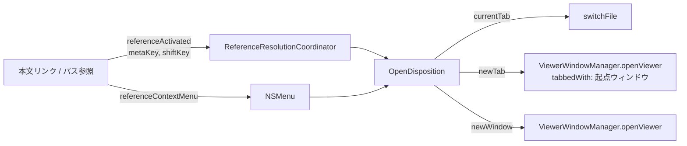

# リンククリックの修飾キー体系 設計

> **これは 2026-07-31 時点の設計スナップショットです。**
> 現在の仕様は [`docs/dev/native-app-design.md`](../../dev/native-app-design.md)
> が単一の情報源。この文書は当時の意図と検討経緯を残すためのもので、
> 現在の実装と食い違っていることがある。着手前に必ずコードで裏を取ること。

ビューア本文中のリンク／パス参照について、修飾キーで「開き方」を選べるようにする。
現状どこにも無い「別タブで開く」を導入し、ctrl+クリック（＝右クリック）では
コンテキストメニューから開き方を選べるようにする。

## 背景

<!-- constrained-by ../../dev/viewer-rendering-dataflow.md -->

ビューア本文のリンク／パス参照は、開き方が 2 通りしかない。

| 操作 | 現状 |
|---|---|
| クリック | 同一ウィンドウで表示を差し替え |
| cmd+クリック | 新規ウィンドウ |
| 右クリック | WKWebView 既定メニュー（befold の項目なし） |

`viewer-main.js` の `_mmdInitReferenceClicks` が `e.metaKey` を `newWindow` フラグとして
`referenceActivated` に載せ、`ReferenceResolutionCoordinator.handleOpenReference(href:newWindow:)`
→ `ViewerWindowController.openReference(_:inNewWindow:)` が `switchFile` と
`openFileInNewWindow` を呼び分けている。開き方が Bool 1 個で表現されているため、
第 3 の開き方を足す余地がない。

タブとして開く経路も存在しない。`ViewerWindowManager.openViewer` は常に独立したウィンドウを作り、
タブ結合は `SessionRestorer.restoreTabGroup` がセッション復元時に
`addTabbedWindow(_:ordered:)` を直接呼ぶ形でしか行われていない。

## 目標

- ビューア本文のリンク／パス参照に対し、クリック／cmd+クリック／cmd+shift+クリック／
  ctrl+クリックの 4 操作がそれぞれ別の開き方に対応する
- 「別タブで開く」を通常のオープン経路として導入する
- 修飾キー → 開き方の対応表を 1 箇所に置き、後から別の導線へ広げられる形にしておく

## 非目標

- **サイドバーの行への適用**。サイドバーは現状の挙動（クリック＝表示切替、
  右クリック＝既存のコンテキストメニュー）を変えない。`List` が内部で使う `NSTableView` は
  cmd+クリックを非連続の複数選択として先に処理するため、同じ修飾キー体系を持ち込むと
  選択操作と衝突する。サイドバーのコンテキストメニューへ「別タブで開く」を足すかどうかは、
  本設計の実装後に別途判断する
- クイックオープン（cmd+P）、Open Recent／Bookmarks メニューなどキーボード主体の導線への適用
- opt+クリックの別名割り当て。1 操作 1 意味に保つ（必要になった時点で追加できる）
- 背面タブ（開いたタブにフォーカスを移さない開き方）の提供

## 操作の対応表

| 操作 | 挙動 |
|---|---|
| クリック | 今のウィンドウで表示を差し替える（現状どおり） |
| cmd+クリック | 同じウィンドウのタブグループに新しいタブを追加し、そのタブを前面にする |
| cmd+shift+クリック | 新しいウィンドウで開く |
| ctrl+クリック／右クリック | コンテキストメニューで開き方を選ぶ |

cmd+クリックの意味が「新規ウィンドウ」から「別タブ（前面）」へ移る。これは本設計で唯一の
非互換な変更であり、意図的に受け入れる。新規ウィンドウは cmd+shift+クリックへ移す。

新規ウィンドウに opt+クリックを充てない理由: macOS では opt は「代替動作」の予約席
（Safari のリンクの opt+クリックはダウンロード、メニューの opt 押下は代替項目の表示）であり、
「別の開き方」ではなく「別種の操作」を期待させる。将来 befold で代替項目を出したくなったときに
先に埋まってしまう不利益もある。

## 設計

### 1. OpenDisposition — 開き方の単一の型

```swift
/// リンクのアクティベーションに対する「開き方」。
enum OpenDisposition {
    case currentTab   // 今のウィンドウで表示を差し替える
    case newTab       // 同じタブグループに追加して前面化する
    case newWindow

    /// 修飾キーからの解釈。開き方を決める唯一の対応表。
    /// JS ブリッジは真偽値、AppKit 側はイベントのフラグと入口が 2 つあるため
    /// 初期化子も 2 つ持つが、判定規則は commandKey/shiftKey の側 1 つに閉じる。
    init(commandKey: Bool, shiftKey: Bool)
    init(modifiers: NSEvent.ModifierFlags)
}
```

- 判定は純粋関数として実装し、`cmd+shift` → `.newWindow`、`cmd` → `.newTab`、
  それ以外 → `.currentTab` の 3 分岐に閉じる。ctrl はコンテキストメニュー扱いのため
  この関数には渡らない（呼び出し側が先に振り分ける）
- ビューア側の JS は修飾キーの生フラグ（`metaKey` / `shiftKey`）だけを送り、意味付けを持たない。
  JS が開き方を決めてしまうと、対応表が JS と Swift に分かれ、後から別の導線へ広げるときに
  二重管理になる

### 2. ビューア本文からの通知

`viewer-main.js` の `referenceActivated` メッセージのペイロードを、
`{ href, newWindow: Bool }` から `{ href, metaKey: Bool, shiftKey: Bool }` へ変更する。

`ReferenceResolutionCoordinator.handleOpenReference` は `(href:newWindow:)` から
`(href:disposition:)` へ移り、ホストへは
`openReference(_ url: URL, disposition: OpenDisposition)` として渡す。
外部 URL（`.external`）は従来どおり修飾キーによらず `NSWorkspace.shared.open` で開き、
解決待ち・解決失敗のパス参照が反応しない点も変えない。

### 3. 直接 HTML モードのリンク

`.html` ファイルを直接ロードしているときは JS ブリッジを通らず、
`ViewerRenderer.decidePolicyForDirectHTMLAware` が `WKNavigationAction.modifierFlags` から
開き方を決めている（現状は `modifierFlags.contains(.command)` で新規ウィンドウ判定）。
ここも `OpenDisposition(modifiers:)` へ合流させ、同じ対応表を通す。
`DirectHTMLLinkAction.openLocalFile` の付随値も `newWindow: Bool` から
`disposition: OpenDisposition` へ変える。

このモードでのコンテキストメニューは対象外とする（WKWebView 既定のメニューのまま）。
`viewer.html` を介さないため JS の `contextmenu` フックを差し込めず、
対応するには別の仕組みが要るため。

### 4. 「別タブで開く」の実装

`ViewerWindowManager.openViewer` に「どのウィンドウのタブグループへ入れるか」を渡せるようにし、
生成したウィンドウを `addTabbedWindow(_:ordered: .above)` してから
`tabGroup?.selectedWindow` に設定して前面化する。

タブ結合の呼び出しは現在 `SessionRestorer.restoreTabGroup` にしかないため、
結合＋選択の手続きを `ViewerWindowManager` 側の 1 メソッドへ寄せ、復元経路もそこを通す。
「タブをどう結合するか」の実装元を 1 箇所に保つのが目的で、復元の挙動自体は変えない。

タブグループの基準ウィンドウは、リンクをクリックしたビューアのウィンドウとする。

### 5. コンテキストメニュー

JS の `contextmenu` イベントでリンク／パス参照を検出し、`preventDefault()` で
WKWebView 既定メニューを抑止したうえで、href を新しいメッセージ（`referenceContextMenu`）で
Swift へ送る。Swift 側は href を既存の resolver で解決し、
`NSMenu.popUp(positioning:at:in:)` で表示する。

表示位置に JS 側の座標は使わない。WKWebView の CSS ピクセルと `NSView` 座標系の変換に加えて
ページズームの影響を受けるため、`window.mouseLocationOutsideOfEventStream`（＝実際のマウス位置）を
使うほうが単純で、ズーム時にもずれない。このためペイロードは `{ href }` だけで足りる。

```text
開く
別タブで開く
新しいウィンドウで開く
──────────────
Finder で開く
──────────────
コピーする
相対パスをコピーする
```

- 並び・文言はサイドバーの既存コンテキストメニューに合わせ、ローカライズキー
  （`sidebar.context.*`）も共有できる範囲は共有する。将来サイドバー側へ
  「別タブで開く」を足すときに、文言と並びが自然に一致する
- 対象が解決できない場合（解決待ち・解決失敗のパス参照）はメニューを出さない。
  クリックが無反応なのと揃える
- 外部 URL 上では「Finder で開く」「相対パスをコピーする」は無効化する

WKWebView 既定メニューを `willOpenMenu` で加工する案は採らない。WebKit が対象として渡すのは
実質 `<a>` 要素だけで、ビューアの主役である `.befold-path-ref`（`<span>` ベース）に対応できない。

## データフロー



## エラー処理

- 解決できないパス参照: クリック時は従来どおり「見つかりません」表示、
  コンテキストメニューは表示しない
- 開こうとしたファイルが消えている: 既存の `FileNotFoundUI` に委ねる（新規ウィンドウ経路と同じ）
- タブ結合に失敗した場合（起点ウィンドウが既に閉じている等）: 独立したウィンドウとして開く。
  「開けない」より「タブにならない」へ縮退させる

## テスト

- `OpenDisposition(modifiers:)` の対応表: 無修飾／cmd／cmd+shift／shift 単独を網羅する
  ユニットテスト。ctrl を含む組み合わせも、振り分けをすり抜けた場合に備えて期待値を固定する
  （ctrl+cmd なら `.newTab` のように、ctrl を無視した解釈になること）
- `ReferenceResolutionCoordinator`: 新ペイロード（metaKey／shiftKey）からホストへ渡る
  disposition が期待どおりであること。外部 URL が修飾キーによらずブラウザ経路へ行くこと
- `ViewerWindowManager`: `newTab` で開いたウィンドウが起点ウィンドウのタブグループに属し、
  選択タブになること。起点ウィンドウが無い場合に独立ウィンドウへ縮退すること
- コンテキストメニュー: 項目の並びと有効／無効（外部 URL のとき Finder・相対パスが無効）を
  メニュー構築の共通型で直接検証する
- JS: `contextmenu` で `preventDefault` が呼ばれ、リンク／パス参照以外ではメッセージを
  送らないこと（既存の viewer テストに追加）
- WKWebView 上での実挙動（メニューの実表示位置、タブの前面化）は自動テスト対象外のため、
  リリース前の手動チェック項目とする
