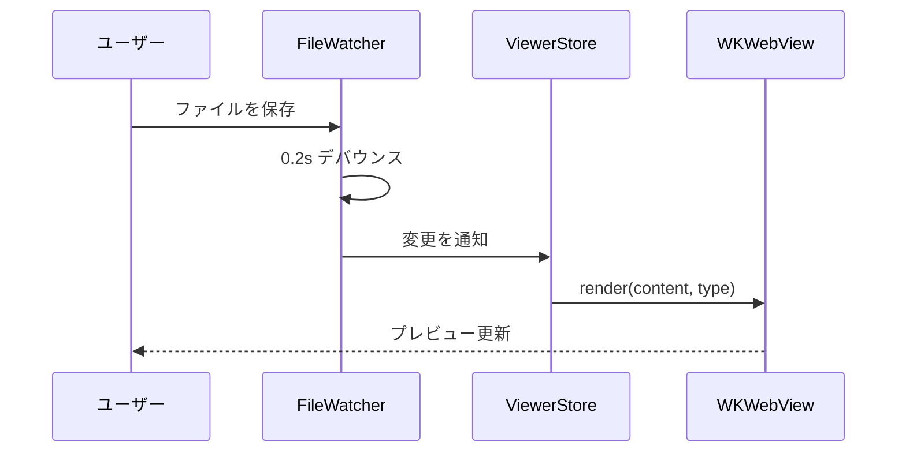

# Markdown サンプル

mmdview の Markdown プレビュー機能を確認するためのサンプルファイル。

## Mermaid ダイアグラム



## Swift コード

```swift
import Foundation

@MainActor
@Observable
final class ViewerStore {
    private(set) var content: String = ""
    private(set) var error: String?

    func update(content: String) {
        self.content = content
        self.error = nil
    }
}
```

## テーブル

| ファイル形式 | 拡張子 | レンダラー |
| --- | --- | --- |
| Mermaid | `.mmd` | mermaid.js |
| Markdown | `.md` | markdown-it.js |
| Markdown + Mermaid | `.md` | 両方 |

## 箇条書き

- ファイル変更をリアルタイムに検知する
- Mermaid と Markdown の両方に対応する
- ウィンドウ位置・サイズをファイル毎に保存する
  - 起動時にタブ構成も復元する

## 番号付き箇条書き

1. `.mmd` または `.md` ファイルを mmdview で開く
2. エディタでファイルを編集して保存する
3. プレビューが自動的に更新されるのを確認する

## 引用

> ファイル変更は `FileWatcher → ViewerStore → evaluateJavaScript` の
> 同一プロセス内伝搬で反映する。
