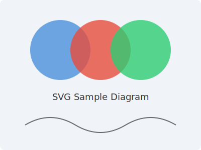
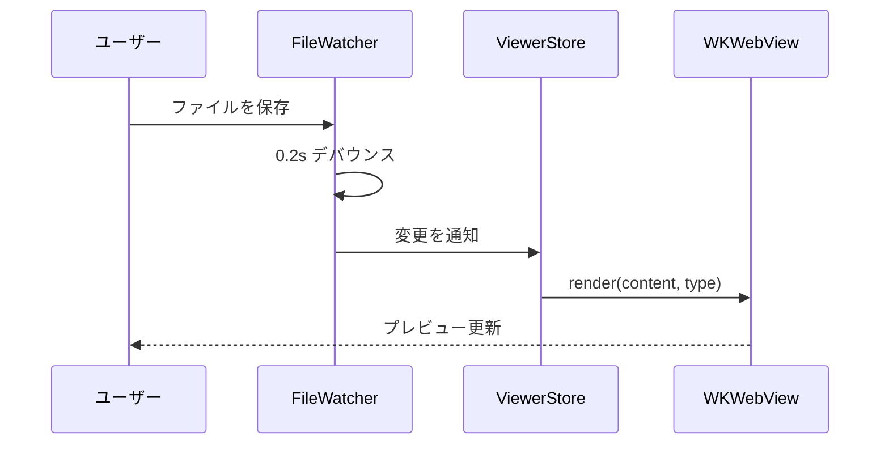

# Markdown サンプル

befold の Markdown プレビュー機能を確認するためのサンプルファイル。
見出し・表・箇条書きといった基本要素に加え、Mermaid 図やコードブロック、
SVG 画像の埋め込みまで、befold が対応する主要なレンダリング機能を
ひととおり確認できる。

## 画像表示

Markdown 内に画像を埋め込むと、SVG もラスター画像と同じように
インラインでレンダリングされる。線画やアイコンのような軽量なベクター
画像であれば、拡大してもぼやけず、ページの読み込みも妨げない。



`.svg` 単体のファイルとしてはもちろん、このように Markdown 文書へ
埋め込んだ場合でもレンダリング結果は変わらない。

## テーブル

| ファイル形式 | 拡張子 | レンダラー |
| --- | --- | --- |
| Mermaid | `.mmd` | mermaid.js |
| Markdown | `.md` | markdown-it.js |
| Markdown + Mermaid | `.md` | 両方 |

## 箇条書き

- ファイル変更をリアルタイムに検知する
- Mermaid と Markdown の両方に対応する
- ウィンドウ位置・サイズをファイル毎に保存する
  - 起動時にタブ構成も復元する

## 番号付き箇条書き

1. `.mmd` または `.md` ファイルを befold で開く
2. エディタでファイルを編集して保存する
3. プレビューが自動的に更新されるのを確認する

## 引用

> ファイル変更は `FileWatcher → ViewerStore → evaluateJavaScript` の
> 同一プロセス内伝搬で反映する。

## Mermaid ダイアグラム



ファイル変更は同一プロセス内で伝搬する。全体の流れは次のとおり。


## Swift コード

```swift
import Foundation

@MainActor
@Observable
final class ViewerStore {
    private(set) var content: String = ""
    private(set) var error: String?

    func update(content: String) {
        self.content = content
        self.error = nil
    }
}
```

## コードブロック

言語指定付きはシンタックスハイライトされる:

```swift
import Foundation

@MainActor @Observable
final class ViewerStore {
    private(set) var content: String = ""

    func update(content: String) {
        self.content = content
    }
}
```

```javascript
function highlightCode(hljs, str, lang) {
  if (hljs && lang && hljs.getLanguage(lang)) {
    return hljs.highlight(str, { language: lang }).value;
  }
  return '';
}
```

言語指定なしはプレーン表示のまま:

```
plain text block
no highlighting here
```
