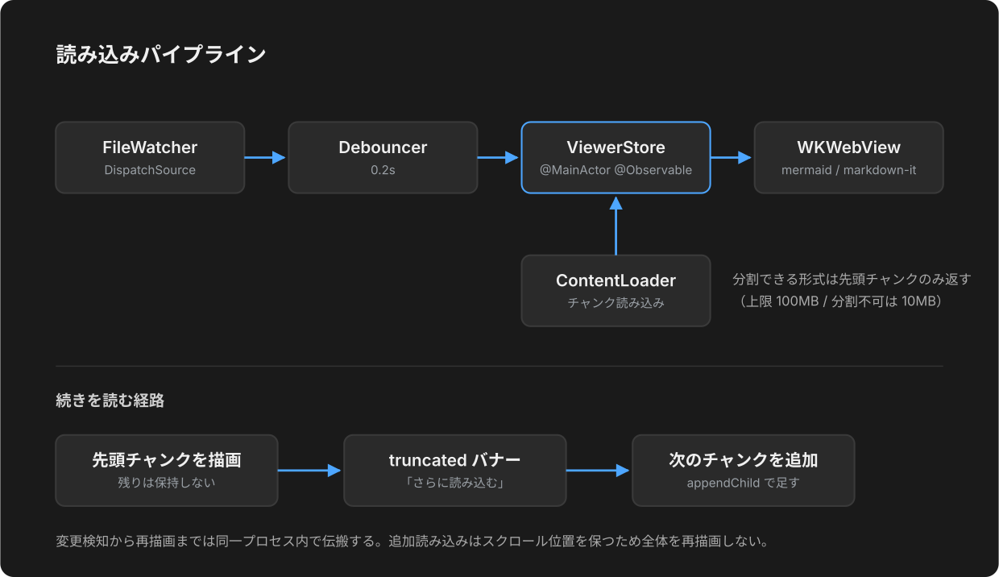
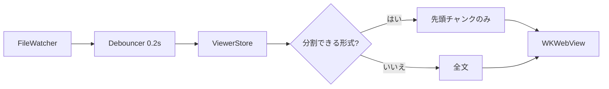
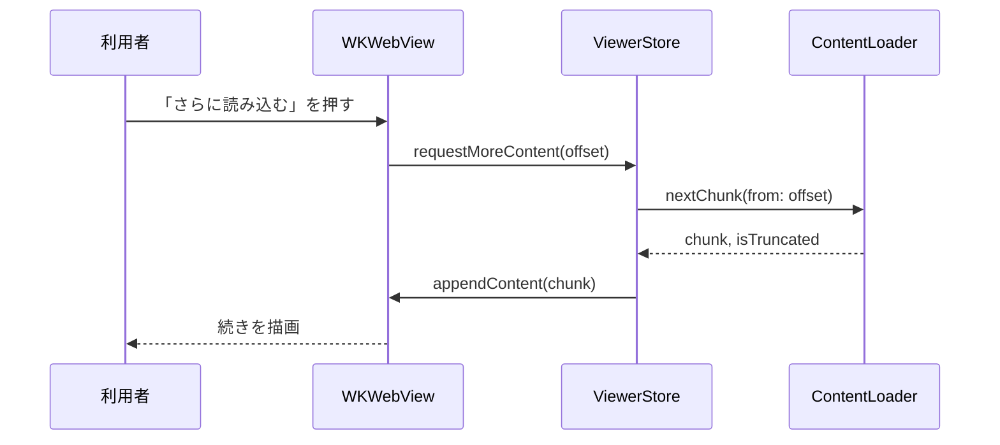

# 大きな Markdown を待たされずに開く

9MB の Markdown を開くと初回描画までに十数秒かかり、常駐メモリが 3GB 近くまで
膨らんでいた。全文を一度に WKWebView へ渡していたことが原因なので、読み込みを
チャンクに分割する。

## 計測

手元の M2 (16GB) で、`ContentLoader` を通した実測値。

| ファイル | サイズ | 行数 | 初回描画 | 常駐メモリ |
| --- | ---: | ---: | ---: | ---: |
| `CHANGELOG.md` | 82KB | 1,204 | 0.1s | 48MB |
| `api-reference.md` | 2.1MB | 31,802 | 2.4s | 620MB |
| `dump.md` | 9.4MB | 142,517 | 13.8s | 2,940MB |

9MB を超えると実用に耐えない。2MB 前後でも体感で引っかかる。

## 採用案

ブロック単位のチャンク読み込みにする。先頭チャンクだけを描画して残りは保持せず、
続きは利用者の操作で追加する。

- 行指向（CSV/TSV・ソースコード）は行境界で切る
- ブロック指向（Markdown）は空行境界で切る。表やコードフェンスの内側では切らない
- 分割できない形式は従来どおり全文を読む
  - Mermaid は図の定義全体が揃っていないと描画できない
  - SVG / HTML も同じ理由で分割不可

> 分割できない形式には 10MB の上限を残す。上限に当たった場合は描画を諦めるのではなく、
> 「truncated」バナーを出して利用者に判断を委ねる。

## 構成図



## 伝搬経路

ファイル変更は同一プロセス内で伝搬する。


```mermaid
flowchart LR
    A[FileWatcher] --> B[Debouncer 0.2s]
    B --> C[ViewerStore]
    C --> D{分割できる形式?}
    D -- はい --> E[先頭チャンクのみ]
    D -- いいえ --> F[全文]
    E --> G[WKWebView]
    F --> G
```

続きを読む操作は、描画済みの末尾位置を起点に次のチャンクだけを渡す。


```mermaid
sequenceDiagram
    participant U as 利用者
    participant V as WKWebView
    participant S as ViewerStore
    participant C as ContentLoader

    U->>V: 「さらに読み込む」を押す
    V->>S: requestMoreContent(offset)
    S->>C: nextChunk(from: offset)
    C-->>S: chunk, isTruncated
    S->>V: appendContent(chunk)
    V-->>U: 続きを描画
```

## 実装

上限判定は形式ごとに分ける。分割できる形式だけ上限を広げる。

```swift
enum ContentLoader {
    static let binaryLimit = 50 * 1024 * 1024
    static let nonChunkableTextLimit = 10 * 1024 * 1024
    static let chunkableTextLimit = 100 * 1024 * 1024

    static func limit(for type: FileType) -> Int {
        if type.isBinaryPreview { return binaryLimit }
        return type.isChunkable ? chunkableTextLimit : nonChunkableTextLimit
    }
}
```

ビューア側は末尾のバナーだけを差し替える。全体を再描画すると
スクロール位置が飛ぶので、`appendChild` で足す。

```javascript
function appendChunk(chunk, isTruncated) {
  const banner = document.querySelector('.truncation-banner');
  banner.remove();
  document.querySelector('#content').insertAdjacentHTML('beforeend', chunk);
  if (isTruncated) {
    renderTruncationBanner();
  }
}
```

## 検証

`dump.md`（9.4MB）で再計測した結果。

```
初回描画   13.8s -> 0.2s
常駐メモリ 2940MB -> 71MB
```

## 未解決

- チャンク境界をまたぐ検索がヒットしない。描画済みの範囲しか検索できない旨を
  バナーに出すか、境界をまたいで再検索するかは決めていない
- 追加読み込み中に元ファイルが書き換えられた場合、オフセットが無効になる
