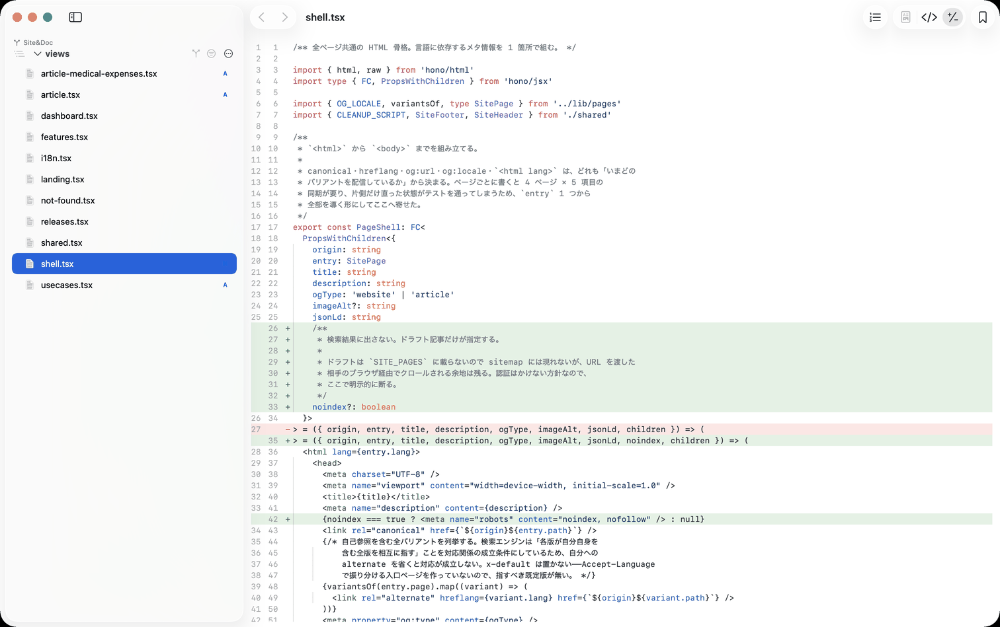
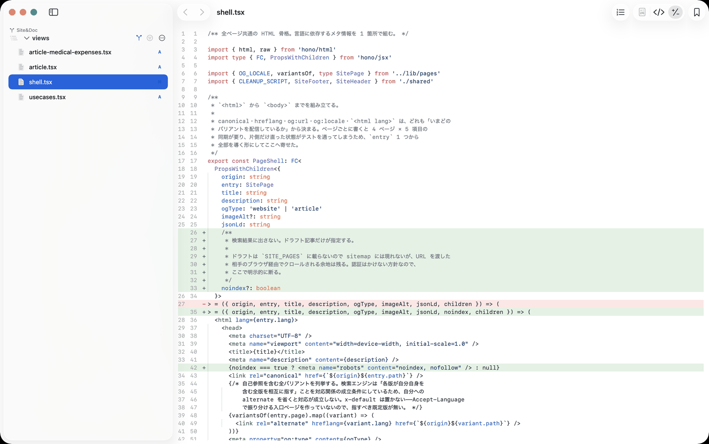
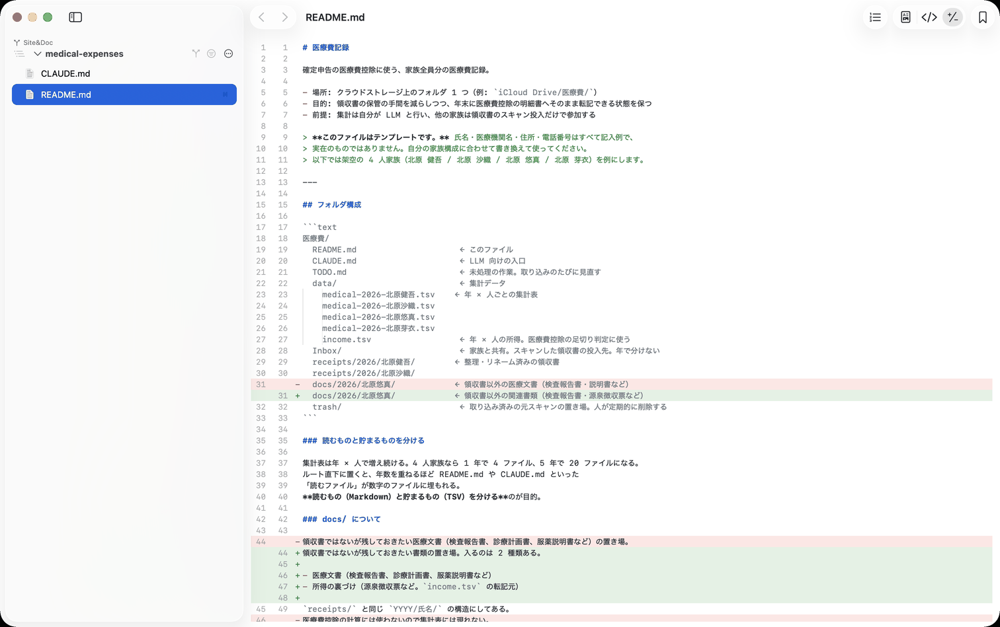

コーディングエージェントに任せる時間が増えるほど、書く時間より読む時間のほうが長くなります。この記事は、AI が書いた変更を人がどう読むかについての記録です。befold の作者が befold 自身の開発で使っている手順を、そのまま書いています。

### 読まないと出てこない指摘がある

型検査も lint もテストも通っているのに、人が読むと直すべき箇所が出てきます。この記事を書いた日のセッションでは、AI が書いた 349 行の運用文書に対して 6 点の指摘が出ました。そのうち 2 つはこういうものです。

- 「この節はそもそも要らない。確定申告に関係しない情報を記録しているだけ」
- 「この制約の説明は、没にした別案を比較したときの名残では」

どちらも、書かれている内容が正しいかどうかの話ではありません。「そもそもここに要るのか」という問いで、機械には出せません。だから人が読む必要があり、読むための道具が要ります。

### 1. 変更のあったファイルだけに絞る

エージェントは 1 回の作業で十数ファイルを触ります。フォルダを開くと、変更していないファイルのほうが多い状態から始まります。

<figure class="article-shots"></figure>

サイドバーを「変更のあるファイルのみ」に切り替えると、読むべきものだけが残ります。下は同じフォルダで、11 ファイルが 4 ファイルになったところです。バッジの A は追加、M は変更を表します。

<figure class="article-shots"></figure>

### 2. 差分のまま読む

ファイル全体を読み直す必要はありません。差分表示に切り替えると、削除された行と追加された行が並びます。比較の起点はデフォルトブランチとの分岐点なので、コミット済みの変更も含めて「このブランチが変えたもの」全体が対象になります。

<figure class="article-shots"></figure>

### 3. 直させて、そのまま見続ける

気づいた点をエージェントに伝えて直してもらうと、開いたままのウィンドウが更新されます。開き直す必要はありません。読む → 指摘する → 直る → もう一度読む、が同じ画面で回ります。

### 知っておくとよいこと

- 差分表示は git 管理下のフォルダでだけ使えます。比較の相手が無いと成り立たないためです。
- 変更が無いファイルでは差分表示を選べません。選べる状態かどうかは開いた直後には決まらず、git の状態が届いてから確定します。
- befold は読むための道具で、編集はできません。直すのはエージェントの仕事です。
