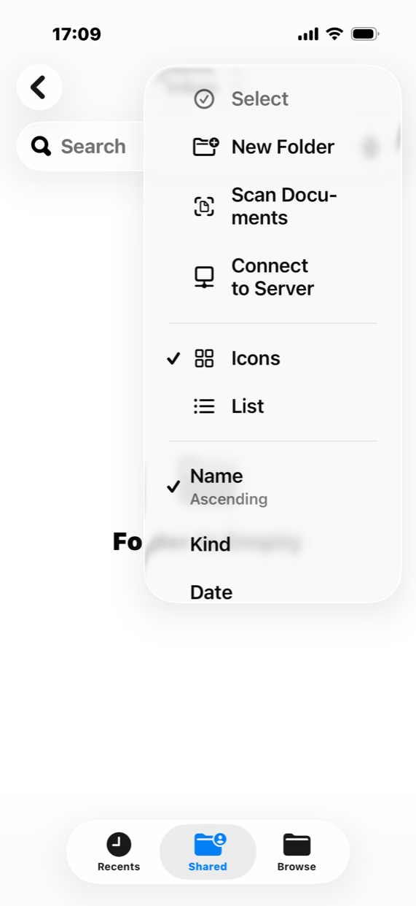
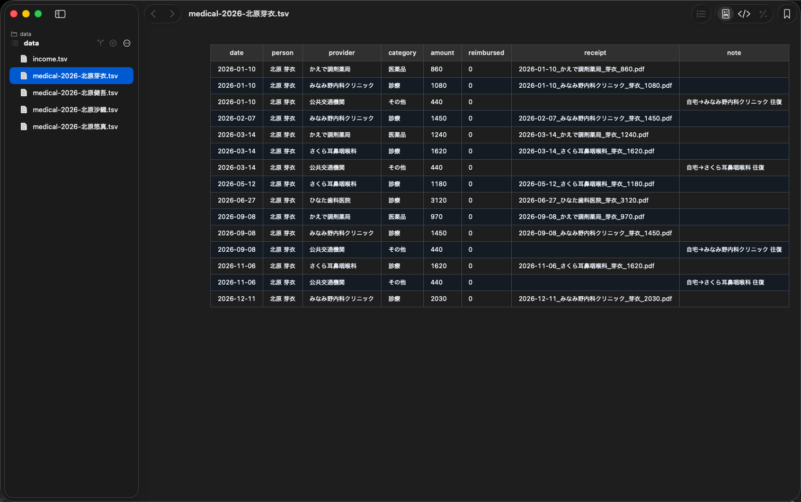
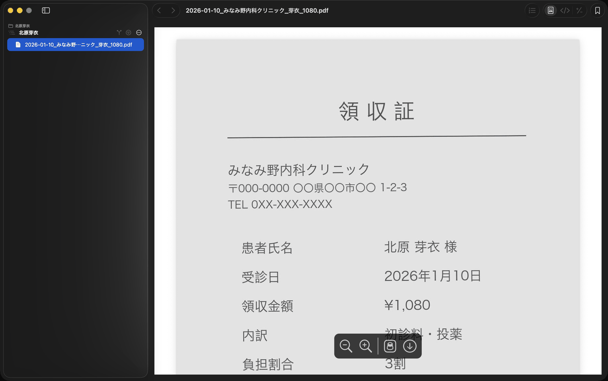
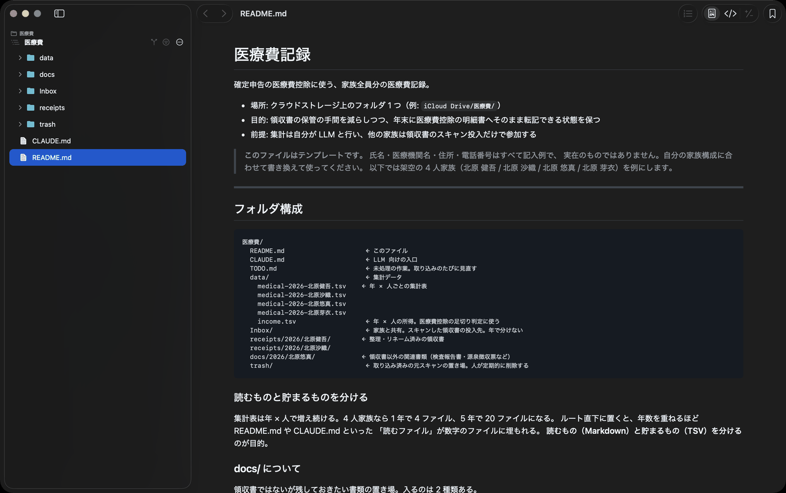

How do you add up a whole family’s medical bills for a tax deduction? Until now I typed them into a spreadsheet by hand. Not any more.

Scan the receipt with your phone and drop it in a folder — that is the whole job. Then you ask Claude to take them in, and it files them and builds the ledger for you. The [CLAUDE.md](../public/templates/medical-expenses/CLAUDE.md) and [README.md](../public/templates/medical-expenses/README.md) I actually run are right here.

### The family side is simple too

Create a “医療費” folder with an “Inbox” inside it on iCloud Drive and **share the Inbox with your family**. That is the whole setup.

> When you get a receipt from a clinic or pharmacy, open the “Inbox” folder in the iPhone Files app and choose “Scan Documents” from the … menu. Take the photo and save. The filename can be anything.

<figure class="article-shots portrait"></figure>

### Then you ask Claude for this

> Check the Inbox!

Claude does the following.

1. Read the date, provider, amount, patient and category out of each unprocessed file in the inbox
2. Append it to the per-year, per-person TSV ledger, in date order
3. Rename the scan to “date_provider_patient_amount.pdf” and move it into the year and person folder under receipts/
4. Report anything it could not read, or whose patient is ambiguous — never fill it in by guessing

The steps and the TSV spec live in a README.md and CLAUDE.md inside the folder, so none of it has to be re-explained each time.

### Checking is easiest in befold

Every file in the 医療費 folder can be checked in befold. The TSV ledger, the receipt PDFs, the Markdown that describes the workflow — all of them open in the same window.

#### 1. The ledger

<figure class="article-shots"></figure>

#### 2. The receipts

The receipts are filed under receipts/ under readable names, so you can check them against the ledger.

<figure class="article-shots"></figure>

#### 3. The rules

The README.md and CLAUDE.md are written for the LLM, but the one who forgets how it works is you. Six months later, when you need to recall how travel costs are recorded, you read it in befold without switching tools.

<figure class="article-shots"></figure>

### What came out of using it

**The medical history piles up.** Since setting this up, I scan and keep whatever the clinic or the pharmacy hands me. I started it for the tax deduction, but what I ended up with is my family's medical history in one place — something I can now ask Claude about. That has turned out to be the more useful half.

**It works out the travel costs too.** Bus and train fares to a clinic also qualify for the deduction. I asked Claude to write up that statement, and it looked up the fares itself and produced it.

### What's next

Today it takes files in, files them, and builds the ledger. As the filing season gets closer I plan to add the step that totals it up for the return itself.

### The template

Copy it and use it. Every name, clinic, address and phone number is a placeholder, and the screenshots in this article use the same fictional data.

- [README.md](../public/templates/medical-expenses/README.md) — Folder layout, the workflow, and the TSV spec
- [CLAUDE.md](../public/templates/medical-expenses/CLAUDE.md) — The entry point for the LLM: read the README, never guess a value

### Worth knowing

- Don’t throw the paper away. Receipts no longer have to be submitted for this deduction, but you must keep them at home for five years.
- The category column matches the four buckets on the deduction form, so the year-end numbers transcribe directly.
- befold only reads. Fixing is the LLM’s job.

This article is not tax advice. Which costs qualify, and how long you must keep the paperwork, can change. Check the National Tax Agency’s guidance and ask your tax office when in doubt.

<ul class="listing-note"><li><a href="https://www.nta.go.jp/taxes/shiraberu/taxanswer/shotoku/1119_qa.htm">No.1119 Procedures for the medical expense deduction (National Tax Agency, in Japanese)</a></li><li><a href="https://www.nta.go.jp/taxes/shiraberu/shinkoku/tebiki/2025/06/6_01.htm">The medical expense deduction statement (National Tax Agency, in Japanese)</a></li></ul>

### Try befold

{{cta}}
